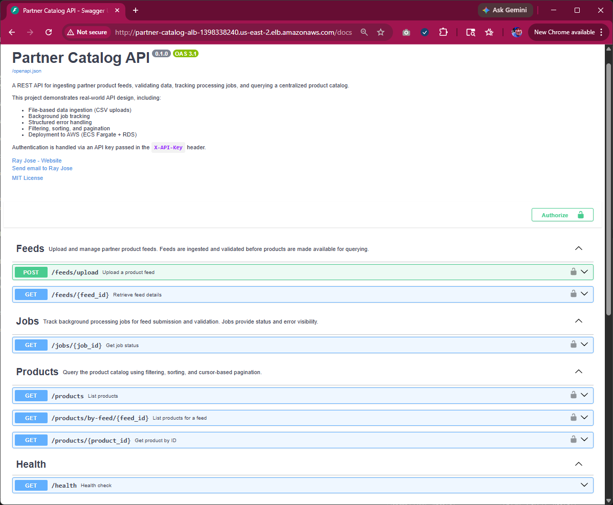
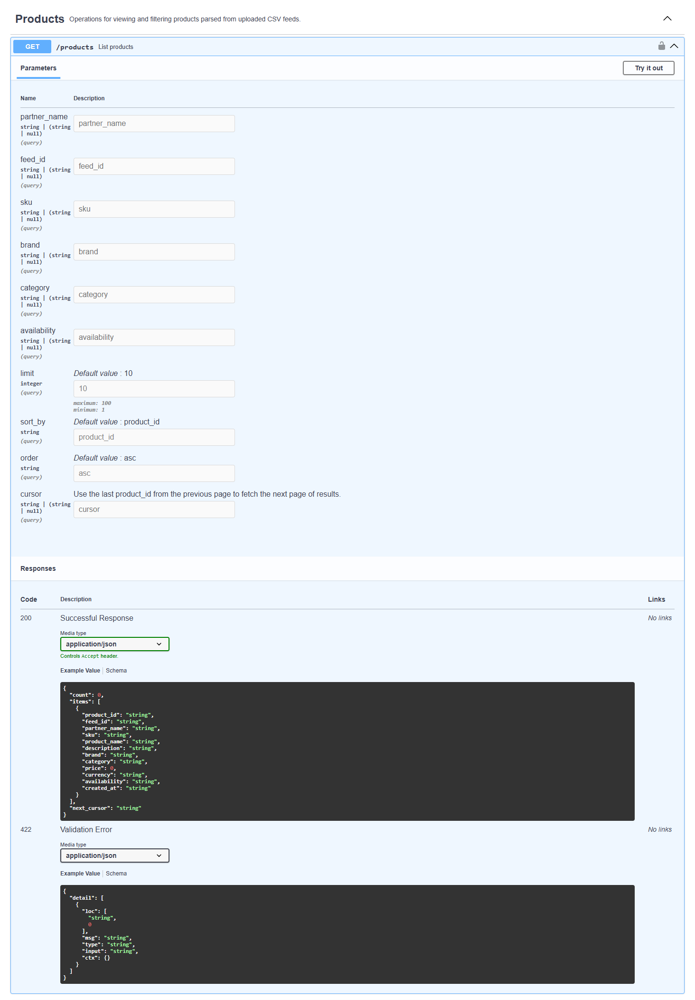
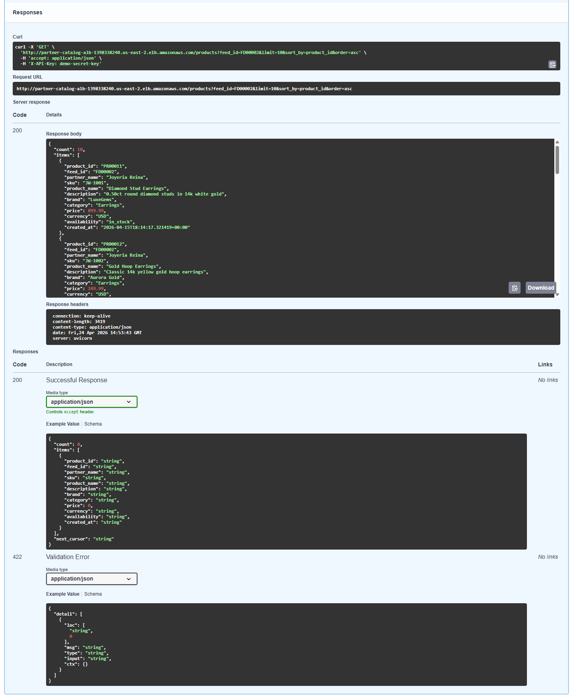

# Partner Catalog API

> Production-style REST API with change-detected ETL, AWS deployment, and developer-focused documentation

A production-style REST API that simulates how multi-partner e-commerce platforms ingest, validate, and serve product catalog data.

This project models a real-world ingestion pipeline with **idempotent ETL processing**, where product data is:

* Inserted when new 
* Updated only when data changes
* Skipped when unchanged
* Reprocessed safely without duplication

---

## Purpose

This project demonstrates:

* REST API design
* Data ingestion workflows
* **Change-detected, idempotent ETL pipeline design**
* Cloud deployment (AWS ECS, RDS, ALB)
* Developer-focused documentation
* Backend system modeling


---

## Live API

Swagger UI:
http://partner-catalog-alb-1398338240.us-east-2.elb.amazonaws.com/docs

> Note: The API may be temporarily offline outside of demonstration periods to control cloud costs. In production environments, HTTPS would be enabled via AWS Certificate Manager and a custom domain.

### Example Request

```bash
curl -H "x-api-key: demo-secret-key" \
  "http://partner-catalog-alb-1398338240.us-east-2.elb.amazonaws.com/products?limit=5"
```

---

## Overview

The Partner Catalog API simulates a real-world e-commerce ingestion pipeline where external partners submit product data feeds that are processed and made available for querying.

Designed to reflect multi-partner catalog ingestion systems used by platforms like Amazon Marketplace and enterprise e-commerce solutions.


## ETL Behavior (Key Design Feature)

The ETL pipeline includes change detection to ensure efficient and accurate data processing:

* **Inserted** → New product (partner + SKU not previously seen)
* **Updated** → Existing product with changed data (e.g., price, availability)
* **Unchanged** → Existing product with identical data
* **Skipped** → Invalid rows (missing required fields)

This design ensures:

* Idempotent reprocessing (safe to run multiple times)
* No unnecessary database writes
* Efficient handling of large or repeated feeds

This reflects real-world ingestion systems where data consistency and performance are critical.


### Key capabilities

* Feed ingestion via CSV upload
* Job-based processing and validation tracking
* Product storage and retrieval
* Filtering, sorting, and pagination
* API key-based authentication
* Change-detected ETL processing (no blind updates)

---

## Tech Stack

* FastAPI (Python)
* PostgreSQL (Amazon RDS)
* Docker
* Amazon ECS (Fargate)
* Application Load Balancer (ALB)
* Amazon ECR
* MkDocs (documentation)

---

## API Documentation (Live)

The API is deployed to AWS and accessible via Swagger UI.

### Swagger Overview



---

### Products Endpoint



---

### Live API Response



Example of a successful request returning product data from the PostgreSQL database hosted on Amazon RDS.

---

## Python SDK Example

This project includes a lightweight Python SDK-style client demonstrating how developers can interact with the API.

- Docs: https://rayajose.github.io/partner-catalog-api/sdk-python/
- Example code: `examples/sdk/`

Run locally:

```bash
cd examples/sdk
python example_usage.py
```


---

## Architecture

The API is built using FastAPI and follows a modular structure:

```
app/
├── main.py
├── routers/
│   ├── feeds.py
│   ├── jobs.py
│   └── products.py
├── schemas/
│   ├── feeds.py
│   ├── jobs.py
│   └── products.py
├── db.py
```

### Ingestion Flow

1. Partner uploads a product feed (`/feeds/upload`)
2. A submission job is created
3. A validation job is created
4. ETL processing is executed (`POST /jobs/{job_id}/run`)
5. Data is compared against existing products
6. New products are inserted, changed products are updated, unchanged products are skipped
7. Products are retrieved via `/products`

---

## ETL Reprocessing Example (Idempotency)

The ETL pipeline is designed to be **idempotent**, meaning the same feed can be processed multiple times without creating duplicate updates or unnecessary database writes.

### First Run (Initial Ingestion)

```text
Products processed: 13. Inserted: 13. Updated: 0. Unchanged: 0. Skipped: 0.
```

All products are new, so they are inserted.

---

### Second Run (Same Data)

```text
Products processed: 13. Inserted: 0. Updated: 0. Unchanged: 13. Skipped: 0.
```

No data has changed, so:

* No inserts
* No updates
* All records are correctly identified as unchanged

---

### After Data Change (e.g., price update)

```text
Products processed: 13. Inserted: 0. Updated: 1. Unchanged: 12. Skipped: 0.
```

Only the modified product is updated.

---

### Why This Matters

This behavior ensures:

* Efficient processing of large or repeated data feeds
* No unnecessary database writes (avoids write amplification)
* Accurate tracking of real data changes
* Safe reprocessing for audit, recovery, and replay scenarios

This reflects real-world ingestion systems where data pipelines must handle frequent reprocessing without degrading performance or data integrity.


---

## Deployment (AWS)

This API is deployed using a containerized cloud architecture:

* FastAPI (Docker)
* Amazon ECS (Fargate)
* Amazon RDS (PostgreSQL)
* Application Load Balancer (ALB)
* Amazon ECR

Full deployment details:
[docs/deployment.md](docs/api/deployment.md)

---

## Authentication

All endpoints require an API key passed in the request header:

```
x-api-key: demo-secret-key
```

Requests without a valid API key will return:

```json
{
  "detail": "Unauthorized"
}
```

---

## Endpoints

### Feeds

* `POST /feeds/upload` — Upload a product feed
* `GET /feeds` — List feeds
* `GET /feeds/{feed_id}` — Retrieve a feed

### Jobs

* `GET /jobs/{job_id}` — Retrieve job status

### Products

* `GET /products` — List and filter products
* `GET /products/{product_id}` — Retrieve a single product
* `GET /products/by-feed/{feed_id}` — Retrieve products by feed

---

## Pagination

The `/products` endpoint uses cursor-based pagination.

* `limit` — number of records to return
* `cursor` — last seen `product_id`

Example:

```
GET /products?limit=10&cursor=PR00010
```

Response includes:

* `count` — number of items returned
* `items` — current page of results
* `next_cursor` — pointer for next page (if more data exists)

---

## Filtering and Sorting

Supported filters:

* `partner_name`
* `feed_id`
* `sku`
* `brand`
* `category`
* `availability`

Sorting:

* `sort_by`: `created_at`, `price`, `product_name`, `brand`, `category`
* `order`: `asc`, `desc`

---

## Sample Data

Example product categories supported:

* Jewelry
* Vinyl records
* Consumer electronics
* Craft beer
* Running shoes

These demonstrate support for multiple partner domains within a unified data model.

---

## Run Locally

Follow these steps to run the API locally using Docker and PostgreSQL.

### Prerequisites

* Python 3.11+
* Docker Desktop
* Git

---

### 1. Clone the repository

```bash
git clone https://github.com/rayajose/partner-catalog-api.git
cd partner-catalog-api
```

---

### 2. Run with Python (optional)

```bash
python -m venv .venv
.\.venv\Scripts\activate

pip install -r requirements.txt
uvicorn main:app --reload
```

Open:

```
http://127.0.0.1:8000/docs
```

---

### 3. Run with Docker (recommended)

Build the image:

```bash
docker build -t partner-catalog-api .
```

Run the container:

```bash
docker run -p 8000:8000 ^
  -e DB_TYPE=postgres ^
  -e DB_HOST=host.docker.internal ^
  -e DB_PORT=5432 ^
  -e DB_NAME=partner_catalog ^
  -e DB_USER=postgres ^
  -e DB_PASSWORD=your_password ^
  partner-catalog-api
```

Open:

```
http://127.0.0.1:8000/docs
```

---

### 4. Required Environment Variables

| Variable    | Description              |
|-------------|--------------------------|
| DB_TYPE     | Database type (postgres) |
| DB_HOST     | Database host            |
| DB_PORT     | Database port            |
| DB_NAME     | Database name            |
| DB_USER     | Database user            |
| DB_PASSWORD | Database password        |

---

### 5. API Authentication

All requests require an API key passed in the header:

```
x-api-key: demo-secret-key
```

---

### Notes

* For local Docker runs, `host.docker.internal` is used to connect to a database running on your host machine
* For AWS deployment, `DB_HOST` is set to the RDS endpoint
* Swagger UI is available at `/docs`

---

## Troubleshooting (Real Issues Resolved)

**Container image not found**

* Cause: Image not pushed to ECR
* Fix: Built, tagged, and pushed image with `latest`

**Database connection timeout**

* Cause: RDS security group blocked ECS traffic
* Fix: Allowed ECS security group inbound on port 5432

---

## Why This Project

Modern platforms rely on ingesting and normalizing data from multiple external partners. This project simulates that pattern by modeling:

- Partner-submitted product feeds
- Asynchronous validation workflows
- Centralized product storage
- Queryable APIs for downstream systems

It reflects the types of backend services used in e-commerce platforms, data pipelines, and integration ecosystems.

---

## What This Project Demonstrates

* End-to-end API design and implementation
* Real-world data ingestion and validation workflows
* Cloud deployment using AWS ECS Fargate and RDS
* Secure service-to-database connectivity
* Developer-focused documentation and usability
* Change-detected, idempotent ETL pipeline design

This project reflects production-style backend system design rather than a simple CRUD application.

---

## Author

Ray Jose

- Portfolio: https://rayajose.github.io/partner-catalog-api/
- Resume: [Download PDF](resume/rayjose-resume.pdf)
- GitHub: https://github.com/rayajose

## Additional Writing Samples

For additional technical writing examples, including structured content, XML/DITA work, technical specifications, and compliance documentation, see:

- https://github.com/rayajose/writing-samples