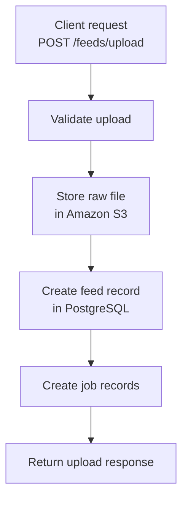
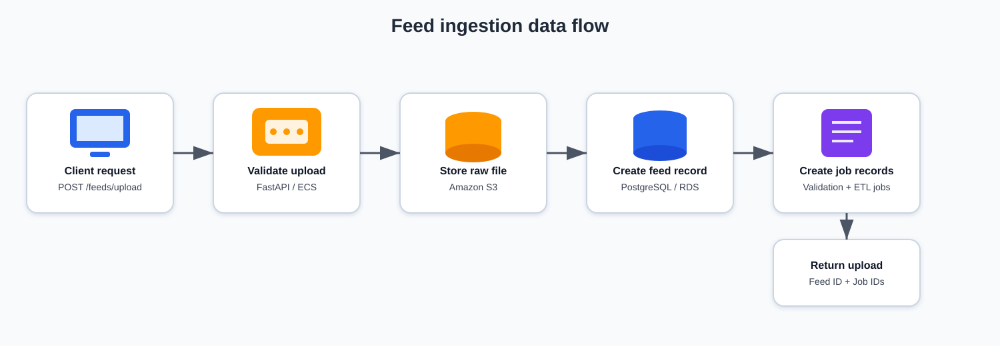
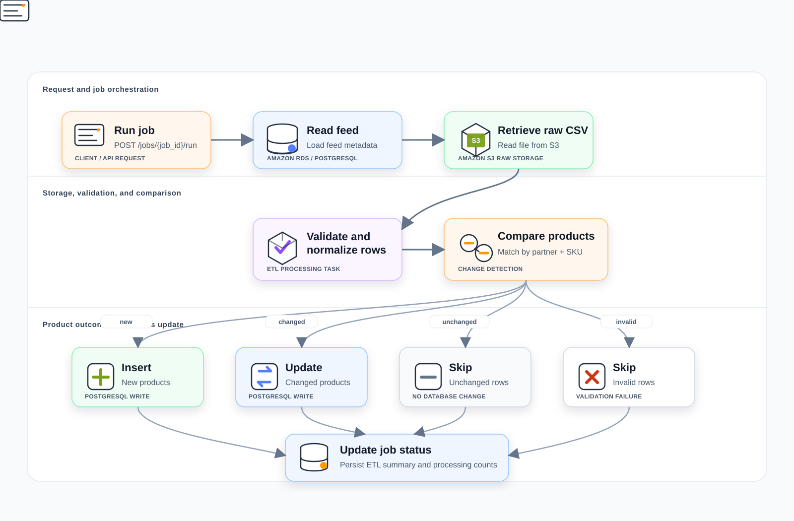
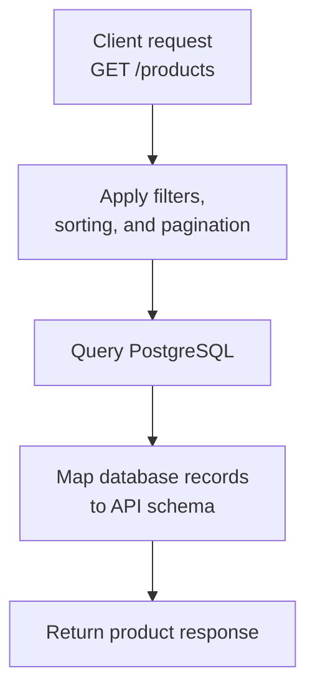

# System architecture

This page explains the implementation architecture of the Commerce Integration API, including system components, application layers, storage boundaries, and key design decisions.

For a higher-level operational view of ingestion, job execution, traceability, and recovery workflows, see [Platform architecture and operational flow](../architecture/platform-architecture.md).


## Architecture principles

The system is designed around:

- Separation of concerns between routing, processing, and persistence
- Clear boundaries between raw and processed data
- Explicit job-based processing
- Independent read and write paths
- Traceable ingestion and processing workflows


## System overview

The Commerce Integration API is a layered platform designed to:

- Ingest partner product feeds
- Store raw feed files in Amazon S3
- Track ingestion workflows using job resources
- Execute ETL processing to transform and load data
- Persist normalized product and order data in PostgreSQL
- Expose product, order, and analytics data through queryable endpoints

The system models a production-style ingestion architecture with separate API, processing, storage, and analytics concerns.


## Architecture layers

| Layer                       | Implementation                       | Responsibility                      |
| --------------------------- | ------------------------------------ | ----------------------------------- |
| Client                      | curl, Postman, Swagger UI            | Sends API requests                  |
| API layer                   | FastAPI routers                      | Handles HTTP requests and responses |
| Application / service layer | ETL, S3 integration, analytics logic | Coordinates processing workflows    |
| Data access layer           | `db.py`                              | Manages database operations         |
| Storage layer               | Amazon S3, PostgreSQL                | Stores raw and processed data       |


## API layer

The API layer handles HTTP interactions and routes requests to application services.

Responsibilities include:

- Request and response handling
- Input validation using FastAPI and Pydantic
- API key authentication
- Triggering job execution
- Routing requests to data and service layers

Example endpoints include:

- `POST /feeds/upload`
- `GET /feeds/{feed_id}`
- `GET /jobs/{job_id}`
- `POST /jobs/{job_id}/run`
- `GET /products`
- `POST /orders`
- `GET /analytics/*`


## Application and service layer

The application and service layer contains processing logic and external service integrations.

Responsibilities include:

- ETL processing
- S3 raw feed storage and retrieval
- Job status updates
- Pipeline coordination
- Analytics query handling

The ETL implementation extracts raw feed data, validates and normalizes records, and loads processed records into PostgreSQL.


## Data access layer

The data access layer encapsulates database interactions.

Responsibilities include:

- Managing database connections
- Performing CRUD operations
- Generating structured identifiers
- Supporting filtering, sorting, and pagination
- Mapping database records to API response schemas

The application supports local and deployed database configurations, with PostgreSQL used for the deployed environment.


## Storage layer

The storage layer separates raw ingestion data from processed application data.

### Amazon S3

Amazon S3 stores raw uploaded feed files.

Example object key:

```text
raw/partners/{partner_name}/feeds/{feed_id}/{filename}.csv
```

S3 supports:

- Raw feed retention
- Reprocessing
- Auditability
- Operational recovery

### PostgreSQL

PostgreSQL stores normalized and queryable data.

Core tables include:

- `feeds`
- `jobs`
- `products`
- `orders`
- `id_counters`


## Feed ingestion data flow

The feed ingestion workflow stores the raw file, creates operational metadata, and initializes processing jobs.



<!---->


## ETL processing data flow

ETL processing reads raw feed data from S3, transforms it, and updates processed records in PostgreSQL.





## Product query data flow

Product query operations read from processed PostgreSQL data.




## Read and write paths

The system separates ingestion workflows from query workflows.

### Write path

The write path handles feed submission and ETL processing.

- Feed upload occurs through `/feeds/upload`
- Raw data is stored in S3
- Processing is tracked through jobs
- Processed data is loaded into PostgreSQL

### Read path

The read path serves processed product, order, and analytics data.

- Product data is retrieved through `/products`
- Order data is retrieved through order endpoints
- Aggregated insights are retrieved through `/analytics/*`
- Read operations operate on processed PostgreSQL data

Because ingestion and ETL processing are separate workflows, read operations may temporarily reflect stale data until processing completes.


## Identifier strategy

The API uses structured identifiers to support traceability.

| Prefix | Resource       | Example   |
| ------ | -------------- | --------- |
| `FD`   | Feed           | `FD00001` |
| `JS`   | Submission job | `JS00001` |
| `JV`   | Validation job | `JV00001` |
| `PR`   | Product        | `PR00001` |

Identifiers are generated using a database-backed counter.


## Job model

Each feed submission creates job resources used to track processing activity.

### Submission job

The submission job tracks feed upload processing.

```text
JSxxxxx
```

### Validation job

The validation job tracks validation and ETL execution.

```text
JVxxxxx
```

Jobs are executed through:

```text
POST /jobs/{job_id}/run
```

For job lifecycle behavior, see [Platform architecture and operational flow](../architecture/platform-architecture.md).


## Analytics layer

The analytics layer provides aggregated reporting and operational insights derived from processed product and order data.

Responsibilities include:

- Executing aggregation queries
- Supporting reporting workflows
- Providing summarized business metrics
- Exposing analytics endpoints through `/analytics/*`

Example analytics include:

- Revenue by partner
- Sales trends over time
- Revenue share distribution

The analytics layer operates on processed data stored in PostgreSQL.


## Deployment architecture

The Commerce Integration API is deployed using a container-based AWS architecture.

| Component                 | Purpose                  |
| ------------------------- | ------------------------ |
| FastAPI application       | API runtime              |
| Docker                    | Application packaging    |
| Amazon ECR                | Container image registry |
| Amazon ECS Fargate        | Container orchestration  |
| Application Load Balancer | Public HTTP routing      |
| Amazon RDS PostgreSQL     | Relational data storage  |
| Amazon S3                 | Raw feed storage         |
| GitHub Pages              | Documentation hosting    |

For deployment details, see [Deployment guide](../architecture/deployment.md).


## Reliability and health monitoring

The deployed architecture supports basic reliability through managed AWS services and health checks.

- ECS maintains desired task count
- ALB performs health checks
- Failed containers are automatically replaced
- RDS manages database availability
- `/health` supports application health verification


## Data mapping strategy

The system separates internal storage models from API representations.

| Layer        | Field name  |
| ------------ | ----------- |
| Database     | `filename`  |
| API response | `file_name` |

This approach:

- Maintains consistent API naming conventions
- Allows internal schema flexibility
- Decouples storage from API presentation


## Design decisions

### Separation of concerns

The system separates routing, processing, persistence, and storage responsibilities.

This improves:

- Maintainability
- Testability
- Operational clarity
- Future extensibility

### Raw and processed data separation

S3 stores raw feed files, while PostgreSQL stores normalized queryable data.

This enables:

- Reprocessing
- Auditing
- Recovery workflows
- Clean separation between ingestion and serving layers

### Controlled job execution

Jobs are initiated through explicit API operations.

This supports:

- Operational visibility
- Controlled execution
- Troubleshooting
- Future migration to queue-based processing

### Cursor-based pagination

The Products API uses cursor-based pagination to support scalable retrieval of large product datasets.

This avoids the performance limitations associated with large offset-based queries.


## Future enhancements

Potential architecture enhancements include:

- Dedicated asynchronous workers
- Queue-based ETL orchestration
- Event-driven ingestion pipelines
- Advanced validation rules
- Horizontal scaling with multiple workers
- Read replicas for analytics workloads
- Infrastructure as Code using Terraform or CloudFormation


## Related documentation

- [Platform architecture and operational flow](../architecture/platform-architecture.md)
- [Workflows](../architecture/workflows.md)
- [Deployment guide](../architecture/deployment.md)
- [Feeds API](../api/feeds.md)
- [Jobs API](../api/jobs.md)
- [Products API](../api/products.md)
- [Orders API](../api/orders.md)
- [Analytics API](../api/analytics.md)
- [Errors](../api/errors.md)

For deployment evidence, see [Screenshots](../api/screenshots.md).