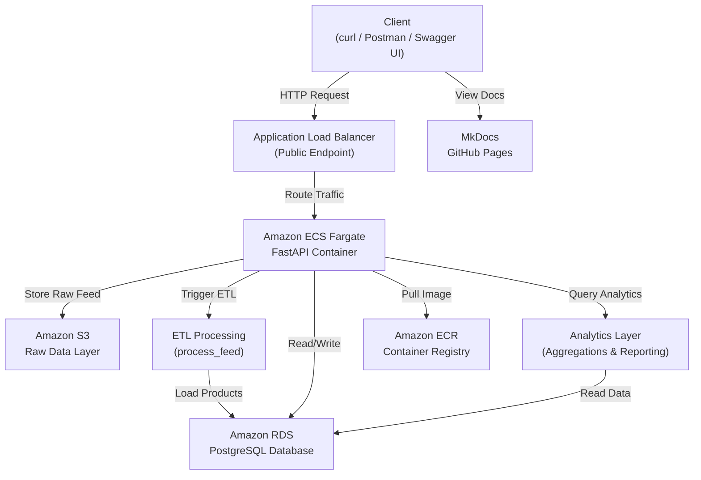
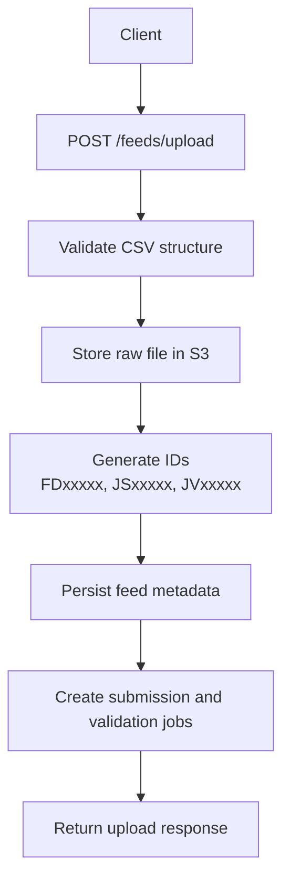
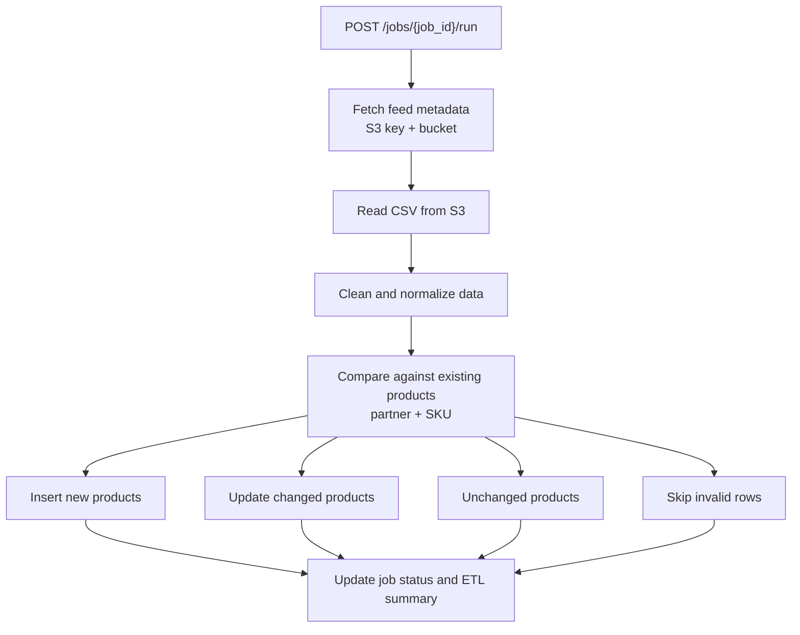
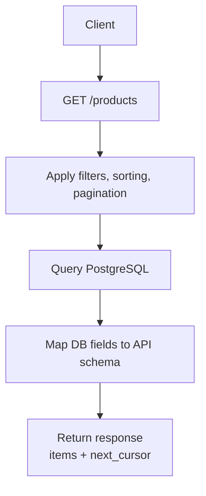
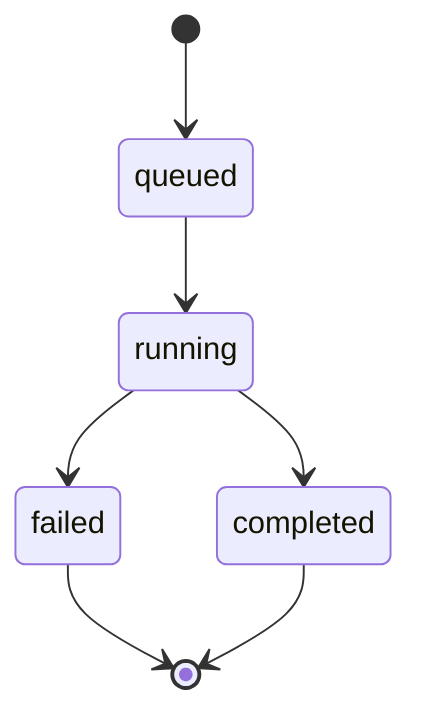

# Architecture

This page explains the architecture of the Commerce Integration API, including its components, data flow, and key design decisions.


## Architecture principles

The system is designed around:

- Separation of concerns (routing, processing, storage)  
- Clear data flow between raw and processed layers  
- Explicit job-based processing  
- Independent read and write paths  


## System overview

The Commerce Integration API is a layered system designed to:

- Ingest partner product feeds (CSV)  
- Store raw data in Amazon S3  
- Track ingestion workflows using job resources  
- Execute ETL processing to transform and load data  
- Persist normalized product data in a relational database  
- Expose product data through queryable endpoints  
- Provide aggregated analytics on processed data  

The system models a production-style ingestion pipeline with clear separation between raw data storage, processing, and serving layers.


## Architecture diagram

The following diagram illustrates the high-level system architecture and request flow:



This architecture separates compute, storage, and networking concerns while introducing a dedicated raw data layer, processing pipeline, and analytics layer.


## Architecture Layers

```text
Client (curl / Postman / Swagger UI)
        ↓
API Layer (FastAPI endpoints)
        ↓
Application / Service Layer (ETL, S3 integration, analytics)
        ↓
Data Access Layer (db.py)
        ↓
Storage Layer:
  - Amazon S3 (raw data)
  - PostgreSQL (processed data)
```


## Router layer (`routers/`)

The router layer handles HTTP interactions and orchestrates application behavior.

Responsibilities:

- Request/response handling
- Input validation using FastAPI and Pydantic
- API key authentication
- Triggering job execution and ETL processing
- Routing requests to the data and service layers

Example endpoints:

- `POST /feeds/upload`
- `GET /feeds/{feed_id}`
- `GET /jobs/{job_id}`
- `POST /jobs/{job_id}/run`
- `GET /products`
- `GET /analytics/*`


## Application / Service layer

This layer contains processing logic and integrations.

Responsibilities:

- ETL processing (`etl/process_feed.py`)

  - Extract data from S3
  - Transform and clean CSV data
  - Load into PostgreSQL

- S3 integration for raw file storage

- Job status updates and pipeline coordination

- Analytics query handling and aggregation logic

This layer separates processing logic from HTTP and persistence concerns.


## Analytics layer

The analytics layer provides aggregated reporting and operational insights derived from processed product and order data.

Responsibilities:

- Execute read-heavy aggregation queries
- Support reporting and dashboard-style workflows
- Provide summarized business and operational metrics
- Expose analytics endpoints through `/analytics/*`

Example analytics include:

- Revenue by partner
- Sales trends over time
- Revenue share distribution
- Product and inventory metrics

The analytics layer operates exclusively on processed data stored in PostgreSQL.

It is designed to support read-heavy reporting and aggregation workflows independently from ingestion and ETL processing operations.


## Data access layer (`db.py`)

This layer encapsulates all database interactions.

Responsibilities:

- Managing database connections (SQLite for local, PostgreSQL in production)
- Performing CRUD operations
- Generating structured identifiers
- Supporting filtering, sorting, and pagination
- Mapping database records to API response schemas


## Storage layer
The storage layer handles raw and processed data using Amazon S3 for ingestion and PostgreSQL for persistent storage.

### Amazon S3 (Raw data layer)

- Stores uploaded CSV files
- Acts as the system of record for raw partner data
- Enables reprocessing and auditability

Example object key:

```text
raw/partners/{partner_name}/feeds/{feed_id}/{filename}.csv
```

### PostgreSQL (Processed data layer)

Stores normalized and queryable data.

Core tables:

- `feeds`
- `jobs`
- `products`
- `id_counters`


## Data flow
The data flow describes how data moves through ingestion, validation, transformation, and access layers.

### Feed ingestion workflow




### ETL processing workflow




### ETL processing behavior

The ETL pipeline uses change detection to ensure efficient and accurate data loading:

```text
Inserted   → New product (partner + SKU not previously seen)  
Updated    → Existing product with changed data (e.g., price, availability)  
Unchanged  → Existing product with identical data  
Skipped    → Invalid row (missing required fields)
```

This design ensures:

- Idempotent reprocessing (safe to run multiple times)
- No unnecessary database updates
- Improved performance at scale


### Product query workflow




## Read vs write paths

The system separates ingestion (write path) from data access (read path).

Because ingestion occurs asynchronously, read operations may temporarily reflect stale data until ETL processing completes.

### Write path (Ingestion)

- Feed upload via `/feeds/upload`
- Raw data stored in S3
- ETL processing transforms and loads data into PostgreSQL

### Read path (Query & Analytics)

- Product data retrieved via `/products`
- Aggregated insights retrieved via `/analytics/*`
- All read operations operate on processed data in PostgreSQL

This separation improves scalability, maintainability, and performance.


## Identifier strategy

The API uses structured identifiers to ensure traceability.

| Prefix | Resource       | Example |
| ------ | -------------- | ------- |
| FD     | Feed           | FD00001 |
| JS     | Submission Job | JS00001 |
| JV     | Validation Job | JV00001 |
| PR     | Product        | PR00001 |

Identifiers are generated using a database-backed counter.


## Job model

Each feed submission generates two job resources:

### Submission job (`JSxxxxx`)

- Tracks feed upload processing
- Typically completes immediately

### Validation job (`JVxxxxx`)

- Executes ETL processing
- Reads raw data from S3
- Transforms and loads product data into PostgreSQL
- Updates job status and ingestion results

Jobs are executed via:

```text
POST /jobs/{job_id}/run
```


## Job lifecycle workflow



| Status    | Description                        |
| --------- | ---------------------------------- |
| queued    | Job created and awaiting execution |
| running   | ETL processing in progress         |
| completed | Job finished successfully          |
| failed    | Job encountered an error           |


## Data mapping strategy

The system separates internal storage models from API representations.

| Layer        | Field Name  |
| ------------ | ----------- |
| Database     | `filename`  |
| API Response | `file_name` |

This approach:

- Maintains consistent API naming conventions
- Allows internal schema flexibility
- Decouples storage from presentation


## Deployment architecture (AWS)

The Commerce Integration API is deployed using a container-based architecture:

- **FastAPI (Docker container)** — application runtime  
- **Amazon ECR** — container image registry (`partner-catalog-api`)  
- **Amazon ECS (Fargate)** — container orchestration  
- **Application Load Balancer (ALB)** — public HTTP endpoint  
- **Amazon RDS (PostgreSQL)** — persistent storage  
- **Amazon S3** — raw data storage  

The source code and documentation are maintained in the `writing-portfolio` repository.  
AWS resources retain the application name `partner-catalog-api` (ECR, ECS, etc.).


## Reliability and health monitoring

- ECS maintains desired task count
- ALB performs health checks
- Failed containers are automatically replaced
- Database availability is managed by RDS


## Documentation and developer experience

- Swagger UI (`/docs`) for interactive API exploration  
- MkDocs documentation hosted on GitHub Pages  
- Consistent request and response formats


## Design decisions
This section outlines the architectural decisions that define system structure, data flow, and separation of responsibilities.
### Separation of concerns

- Router layer handles HTTP
- Service layer handles ETL and integrations
- Data layer handles persistence
- Storage layers separate raw and processed data


### Raw vs processed data separation

- S3 stores immutable raw data
- PostgreSQL stores normalized queryable data

This enables reprocessing, auditing, and scalability.


### Controlled job execution

- Jobs are initiated through explicit API operations
- Processing is modeled as a job-based workflow
- Clients interact with ingestion asynchronously through job status resources
- Current ETL execution occurs within the application runtime
- The architecture supports future migration to dedicated workers or queue-based execution


### Cursor-based pagination

- Uses `product_id` as cursor
- Avoids offset performance issues
- Scales efficiently with large datasets


### Cloud-native deployment

- Containerized application (Docker)
- Serverless compute (ECS Fargate)
- Managed storage (S3 + RDS)
- Load-balanced public access (ALB)


## Future enhancements

- Asynchronous job processing (queues/workers)
- Event-driven ingestion pipelines
- Advanced validation rules
- Horizontal scaling with multiple workers
- Read replicas for database scaling
- Infrastructure as Code (Terraform / CloudFormation)

## Related documentation

- [Index](../index.md)
- [Feeds API](feeds.md)
- [Jobs API](jobs.md)
- [Products API](products.md)
- [Analytics API](analytics.md)
- [Workflows](workflows.md)
- [Errors](errors.md)

For deployment evidence, see [Screenshots](screenshots.md).
