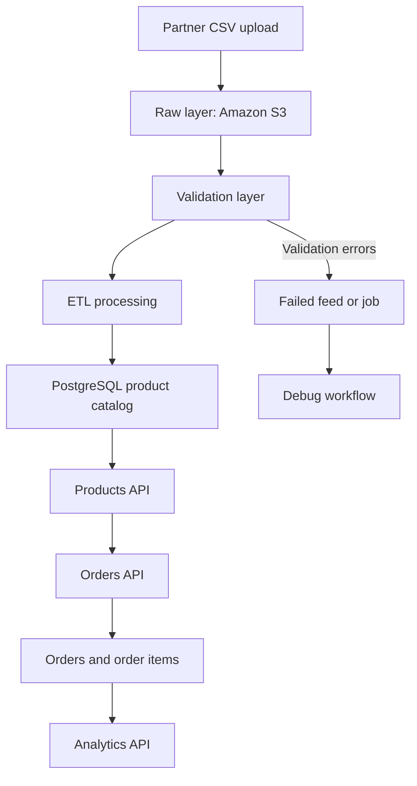

# Get started

Use the Commerce Integration API to upload product feeds, process them through an ETL pipeline, query normalized catalog data, and create transactional orders.

## Base URLs

| Target     | URL                                                                                                                                                                         |
| ---------- | --------------------------------------------------------------------------------------------------------------------------------------------------------------------------- |
| Local      | `http://localhost:8000`                                                                                                                                                     |
| AWS        | `http://partner-catalog-alb-1398338240.us-east-2.elb.amazonaws.com`                                                                                                         |
| Swagger UI | <a href="http://partner-catalog-alb-1398338240.us-east-2.elb.amazonaws.com/docs" target="_blank">http://partner-catalog-alb-1398338240.us-east-2.elb.amazonaws.com/docs</a> |

## Authenticate requests

Include your API key in every request:

```text
x-api-key: demo-secret-key
```

Requests without a valid API key return `401` or `403`.

## Quickstart

Use this minimal workflow to ingest catalog data, query products, and create an order.

### 1. Upload a feed

```bash
curl -X POST "http://localhost:8000/feeds/upload" \
  -H "x-api-key: demo-secret-key" \
  -F "file=@electronics_catalog.csv" \
  -F "partner_name=Tronics"
```

### Example response

```json
{
  "feed_id": "FD00001",
  "status": "uploaded",
  "job_id": "JS00001"
}
```

### 2. Run ETL processing

```bash
curl -X POST "http://localhost:8000/jobs/JV00001/run" \
  -H "x-api-key: demo-secret-key"
```

### 3. Query products

```bash
curl -X GET "http://localhost:8000/products?limit=5" \
  -H "x-api-key: demo-secret-key"
```

### Example response

```json
{
  "count": 1,
  "items": [
    {
      "product_id": "PR00001",
      "feed_id": "FD00001",
      "partner_name": "Acme Corp",
      "sku": "ACM-001",
      "product_name": "Running Shoes",
      "description": "Lightweight running shoes designed for comfort and performance.",
      "brand": "Acme",
      "category": "Footwear",
      "price": 79.99,
      "currency": "USD",
      "availability": "in_stock",
      "created_at": "2026-04-15T10:00:00Z"
    }
  ]
}
```

### 4. Create an order

```bash
curl -X POST "http://localhost:8000/orders" \
  -H "x-api-key: demo-secret-key" \
  -H "Content-Type: application/json" \
  -d '{
    "partner_name": "Acme Corp",
    "customer_reference": "ORDER-1001",
    "items": [
      {
        "product_id": "PR00001",
        "quantity": 2
      }
    ]
  }'
```

### Example response

```json
{
  "order_id": "OR00001",
  "partner_name": "Acme Corp",
  "customer_reference": "ORDER-1001",
  "status": "created",
  "total_amount": 159.98,
  "currency": "USD",
  "items": [
    {
      "order_item_id": "OI00001",
      "product_id": "PR00001",
      "sku": "ACM-001",
      "product_name": "Running Shoes",
      "quantity": 2,
      "unit_price": 79.99,
      "line_total": 159.98
    }
  ]
}
```

## Understand the workflow

Product data becomes available only after ingestion and ETL processing complete.

Typical workflow:

```text
Upload feed
  → Validate
  → Transform
  → Load catalog data
  → Query products
  → Create orders
  → Generate analytics
```

## Ingestion and order flow



## Use query parameters

Use query parameters to filter, sort, and paginate results returned by the API.

### Pagination

| Parameter | Description                               |
| --------- | ----------------------------------------- |
| `limit`   | Number of results (default: 10, max: 100) |
| `cursor`  | Cursor for the next page                  |

### Filtering

| Parameter      | Description            |
| -------------- | ---------------------- |
| `partner_name` | Filter by partner      |
| `feed_id`      | Filter by feed         |
| `brand`        | Filter by brand        |
| `category`     | Filter by category     |
| `availability` | Filter by availability |

### Sorting

| Parameter | Description                                              |
| --------- | -------------------------------------------------------- |
| `sort_by` | Field to sort by (`price`, `created_at`, `product_name`) |
| `order`   | `asc` or `desc`                                          |

## Handle errors

The API uses standard HTTP status codes.

| Status | Meaning                       |
| ------ | ----------------------------- |
| `200`  | Request successful            |
| `201`  | Resource created successfully |
| `400`  | Invalid request               |
| `401`  | Missing API key               |
| `403`  | Invalid API key               |
| `404`  | Resource not found            |
| `409`  | Request conflict              |
| `422`  | Validation failure            |
| `500`  | Server error                  |

### Example error

```json
{
  "detail": "Invalid or missing API key"
}
```

## Resource identifiers

The platform uses structured identifiers for feeds, jobs, products, and orders.

| Prefix    | Resource       |
| --------- | -------------- |
| `FDxxxxx` | Feed           |
| `JSxxxxx` | Submission Job |
| `JVxxxxx` | Validation Job |
| `PRxxxxx` | Product        |
| `ORxxxxx` | Order          |
| `OIxxxxx` | Order Item     |

## Next steps

- Follow [Ingest a product feed end-to-end](ingest-product-feed.md)
- Use [Feeds API](feeds.md) to manage uploads
- Use [Jobs API](jobs.md) to track processing
- Use [Products API](products.md) to query catalog data
- Use [Orders API](orders.md) to create and retrieve order data
- Use [Analytics API](analytics.md) to analyze sales and revenue
- See [Debug a product feed](../operations/debug-product-feed.md) to troubleshoot failures