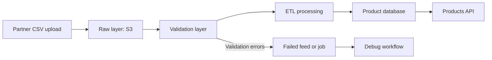

# Get started

Use the Partner Catalog API to upload product feeds, process them through an ETL pipeline, and query normalized product data.


## Base URLs


| Target     | URL                                                                                                                                                                         |
| ---------- | --------------------------------------------------------------------------------------------------------------------------------------------------------------------------- |
| local      | `http://localhost:8000`                                                                                                                                                     |
| AWS        | `http://partner-catalog-alb-1398338240.us-east-2.elb.amazonaws.com`                                                                                                         |
| Swagger UI | <a href="http://partner-catalog-alb-1398338240.us-east-2.elb.amazonaws.com/docs" target="_blank">http://partner-catalog-alb-1398338240.us-east-2.elb.amazonaws.com/docs</a> |


## Authenticate requests

Include your API key in every request:

```text
x-api-key: demo-secret-key
```

Requests without a valid API key return `401` or `403`.


## Quickstart

Use this minimal workflow to ingest and query product data:

### 1. Upload a feed

```bash
curl -X POST "http://localhost:8000/feeds/upload" \
  -H "x-api-key: demo-secret-key" \
  -F "file=@electronics_catalog.csv" \
  -F "partner_name=Tronics"
```


### 2. Run ETL processing

```bash
curl -X POST "http://localhost:8000/jobs/JV00009/run" \
  -H "x-api-key: demo-secret-key"
```


### 3. Query products

```bash
curl -X GET "http://localhost:8000/products?limit=5" \
  -H "x-api-key: demo-secret-key"
```


## Understand the response

```json
{
  "count": 1,
  "items": [
    {
      "product_id": "PR00001",
      "feed_id": "FD00001",
      "partner_name": "Acme Corp",
      "sku": "ACM-001",
      "product_name": "Running Shoes",
      "description": "Lightweight running shoes designed for comfort and performance.",
      "brand": "Acme",
      "category": "Footwear",
      "price": 79.99,
      "currency": "USD",
      "availability": "in_stock",
      "created_at": "2026-04-15T10:00:00Z"
    }
  ]
}
```

- `count`: Total number of results returned
- `items`: List of product records


## Understand the workflow

Product data is only available **after ingestion completes**.

Typical workflow:

```text
Upload feed → Validate → Transform → Load → Query products
```


## Ingestion flow




## Use query parameters
Use query parameters to filter, sort, and paginate results returned by the API.

### Pagination

| Parameter | Description                               |
| --------- | ----------------------------------------- |
| `limit`   | Number of results (default: 10, max: 100) |
| `cursor`  | Cursor for the next page                  |


### Filtering

| Parameter      | Description            |
| -------------- | ---------------------- |
| `partner_name` | Filter by partner      |
| `feed_id`      | Filter by feed         |
| `brand`        | Filter by brand        |
| `category`     | Filter by category     |
| `availability` | Filter by availability |


### Sorting

| Parameter | Description                                              |
| --------- | -------------------------------------------------------- |
| `sort_by` | Field to sort by (`price`, `created_at`, `product_name`) |
| `order`   | `asc` or `desc`                                          |


## Handle errors

The API uses standard HTTP status codes:

| Status | Meaning            |
| ------ | ------------------ |
| 200    | Request successful |
| 400    | Invalid request    |
| 401    | Missing API key    |
| 403    | Invalid API key    |
| 404    | Resource not found |
| 500    | Server error       |

### Example error

```json
{
  "detail": "Invalid or missing API key"
}
```


## Next steps

- Follow [Ingest a Product Feed End-to-End](feeds.md)
- Use [Feeds](feeds.md) to manage uploads
- Use [Jobs](jobs.md) to track processing
- Use [Products](products.md) to query catalog data
- See [Debug a Failed Feed](debug-product-feed.md) to troubleshoot failures
