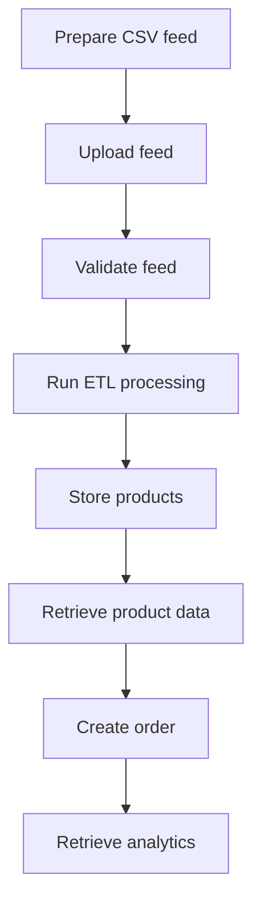
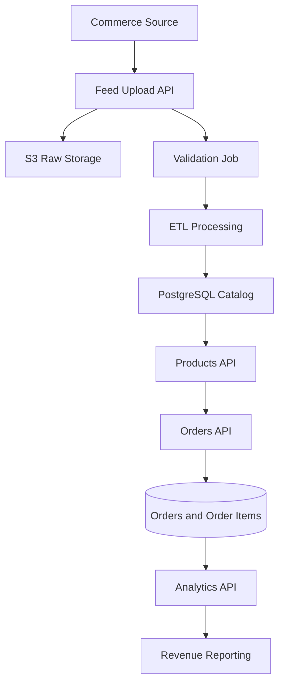

# Integrate with the Commerce Integration API

Use this guide to build a complete commerce data integration workflow, from product feed upload through catalog retrieval, order creation, and analytics.

The Commerce Integration API supports a common integration workflow:

1. Prepare a partner product feed.
2. Upload the feed.
3. Monitor validation status.
4. Process the feed through the ETL pipeline.
5. Query product data.
6. Create and retrieve order data.
7. Retrieve analytics.

## When to use this guide

Use this guide to design, implement, or document a repeatable commerce data integration workflow.

This guide explains how the major integration components work together, including feed preparation, asynchronous validation, ETL processing, product retrieval, order creation, and analytics.

For a step-by-step walkthrough of a single feed upload, see [Ingest a product feed end to end](ingest-product-feed.md).

For complete endpoint details, see the related API reference pages:

- [Feeds API](feeds.md)
- [Jobs API](jobs.md)
- [Products API](products.md)
- [Orders API](orders.md)
- [Analytics API](analytics.md)

## Integration architecture

The Commerce Integration API uses an asynchronous ingestion pipeline designed to support large partner product feeds and long-running processing operations.

When a partner uploads a feed:

1. The raw CSV file is stored in Amazon S3.
2. A feed record is created.
3. A validation job checks the file structure and required fields.
4. An ETL process transforms and loads valid product data into the product catalog.
5. Products become available through query endpoints.
6. Orders can be created from catalog products.
7. Analytics endpoints aggregate order and revenue data.

## Asynchronous processing model

Feed ingestion occurs asynchronously. Uploading a feed does not immediately make products available in the catalog.

Integrations should:

- Track validation and ETL job status.
- Handle delayed processing.
- Retry failed operations when appropriate.
- Avoid assuming immediate data availability after upload.

Because ingestion occurs asynchronously, downstream systems should account for eventual consistency between feed submission and catalog availability.

Integrations should avoid tightly coupling downstream workflows to immediate catalog availability after feed submission.

## Scalability considerations

The ingestion pipeline is designed to support scalable commerce data processing across multiple partner integrations and large product catalogs.

Key scalability characteristics include:

- Asynchronous processing for long-running ingestion operations
- Independent validation and ETL execution
- Support for large batch product feeds
- Incremental catalog update workflows
- Retry and replay support for failed processing operations
- Decoupled storage and processing architecture

Integrations should avoid assuming immediate consistency between feed upload and downstream catalog availability.

## Integration design considerations

Before implementing a partner integration, define how product feeds will be generated, validated, monitored, and consumed across downstream systems.

### Feed delivery strategy

Determine how partners will provide catalog updates.

Common approaches include:

- Full catalog feeds submitted on a scheduled basis.
- Incremental updates containing only changed products.
- Event-driven uploads triggered by inventory or pricing changes.

Large catalogs may require batching or scheduled uploads to reduce processing overhead.

### Data validation strategy

Validate feed files before upload whenever possible.

Recommended validations include:

- Required header verification
- CSV format validation
- Duplicate SKU detection
- Price and currency formatting checks
- Availability value normalization

Pre-validation reduces failed jobs and minimizes unnecessary ETL processing.

### Job monitoring strategy

Because ingestion occurs asynchronously, integrations should monitor validation and ETL job status throughout processing.

Recommended practices include:

- Polling job status endpoints at scheduled intervals
- Logging failed jobs for operational review
- Alerting on repeated validation or ETL failures
- Tracking processing duration for large feeds

### Product retrieval strategy

Determine how downstream systems will consume product data.

For large catalogs:

- Use pagination when querying products
- Filter results when possible
- Avoid unnecessary full catalog retrievals
- Cache frequently requested product data when appropriate

### Order processing strategy

Orders are created transactionally using catalog product data.

During order creation:

- Product availability is validated.
- Product pricing is copied into each order item.
- Line totals are calculated at order creation time.
- Order totals are calculated from associated order items.

This approach preserves order pricing independently from future catalog changes.

### Analytics and reporting

Analytics endpoints can support:

- Partner revenue reporting
- Product performance analysis
- Operational dashboards
- Feed processing reconciliation
- Order volume and sales trend analysis

Analytics endpoints aggregate sales and revenue data from submitted orders and processed catalog records.

## ETL processing behavior

After validation completes successfully, the ETL pipeline transforms and loads product data into the catalog database.

During processing, the system evaluates each product row independently and determines whether the product should be inserted, updated, left unchanged, or skipped.

### ETL result definitions

| Result    | Description                                                                                 |
| --------- | ------------------------------------------------------------------------------------------- |
| Inserted  | A new product was created because the partner and SKU combination did not previously exist. |
| Updated   | An existing product was updated because one or more fields changed.                         |
| Unchanged | An existing product matched the incoming data and required no update.                       |
| Skipped   | The row could not be processed because validation or required field checks failed.          |

### Change detection behavior

The ETL pipeline performs change detection to avoid unnecessary database updates.

For existing products, the system compares incoming values against the current catalog record. Products are updated only when one or more fields have changed.

This behavior helps:

- Reduce unnecessary database writes
- Improve processing efficiency
- Minimize downstream synchronization overhead
- Preserve accurate update history

### Idempotent processing considerations

Integrations should account for repeat uploads and retry scenarios.

Because unchanged products are not rewritten, the ingestion pipeline supports idempotent processing behavior for repeated feed submissions containing the same product data.

## Error handling and operational resilience

Integrations should account for validation failures, ETL processing issues, delayed processing, malformed product data, and order creation failures.

Because feed ingestion is asynchronous, failures may occur after a successful upload response is returned.

### Common failure scenarios

| Scenario                 | Description                                                  |
| ------------------------ | ------------------------------------------------------------ |
| Invalid CSV format       | The uploaded file does not meet CSV formatting requirements. |
| Missing required headers | Required fields such as `sku` or `product_name` are missing. |
| Invalid product data     | Product rows contain malformed or unsupported values.        |
| ETL processing failure   | An internal processing error prevents product ingestion.     |
| Product unavailable      | A requested product cannot be used to create an order.       |
| Missing order resource   | A requested order does not exist.                            |
| Authentication failure   | The request does not include a valid API key.                |

### Recommended operational practices

Implementations should:

- Log upload, job, product, and order identifiers for troubleshooting
- Monitor validation and ETL job status
- Retry failed uploads when appropriate
- Alert on repeated processing failures
- Retain source feed files for auditing and replay scenarios
- Verify product availability before creating downstream orders

### Troubleshooting workflows

When troubleshooting failed processing:

1. Review validation job output.
2. Identify invalid rows or formatting issues.
3. Correct feed data issues.
4. Re-upload the corrected feed.
5. Verify successful ETL completion before querying products.
6. Verify product availability before creating orders.

For additional troubleshooting guidance, see [Debug a failed feed](debug-product-feed.md).

## Related documentation

Use the following resources to implement and support partner catalog integrations.

### Tutorials and workflows

- [Ingest a product feed end to end](ingest-product-feed.md)
- [Debug a failed feed](debug-product-feed.md)

### API reference

- [Feeds API](feeds.md)
- [Jobs API](jobs.md)
- [Products API](products.md)
- [Orders API](orders.md)
- [Analytics API](analytics.md)

### Specifications and architecture

- [CSV Feed File Specification](../sop/csv-feed-file-spec.md)
- [Architecture overview](architecture.md)

## Summary

The Commerce Integration API provides a scalable ingestion, catalog management, order processing, and analytics platform for integrating external commerce data into downstream product and reporting workflows.

Successful integrations should account for validation workflows, ETL processing behavior, operational monitoring, downstream product consumption, and order creation patterns when designing production ingestion pipelines.