# System resource model

## Overview

This page describes the primary resources used within the Commerce Integration API.

Feeds, jobs, products, customers, addresses, and orders represent the core entities supporting ingestion, transactional processing, customer workflows, and analytics workflows across the platform.

These resources provide structured relationships, workflow traceability, and operational visibility throughout the ingestion lifecycle.

## Resource relationships

### Resource lifecycle

1. A partner uploads a feed
2. The system creates processing jobs
3. ETL workflows validate and transform ingestion data
4. Products are normalized and stored for retrieval
5. Customers and shipping addresses may be created
6. Orders are created from catalog products
7. Operational metadata is retained for troubleshooting and auditing

## Feed

A feed represents a partner-submitted product data file entering the ingestion pipeline.

Feeds serve as the entry point for asynchronous validation and ETL workflows.

### Feed fields

| Field                | Description                          |
| -------------------- | ------------------------------------ |
| `feed_id`            | Unique feed identifier (`FDxxxxx`)   |
| `partner_name`       | Name of the submitting partner       |
| `file_name`          | Uploaded file name                   |
| `content_type`       | MIME type of the uploaded file       |
| `status`             | Feed upload status                   |
| `uploaded_at`        | Upload timestamp                     |
| `validation_job_id`  | Associated validation job identifier |
| `validation_status`  | Current ETL processing state         |
| `validation_message` | ETL processing result summary        |
| `raw_file_s3_key`    | S3 object key for raw feed storage   |
| `raw_file_bucket`    | S3 bucket storing the raw feed       |

### Operational details

- Feed status reflects upload state only
- ETL lifecycle state is tracked through validation jobs
- Raw feed files are retained to support replay and troubleshooting workflows
- Feed metadata supports ingestion traceability

## Job

A job represents an asynchronous processing task executed by the ingestion platform.

Jobs provide visibility into ingestion, validation, ETL execution, and fulfillment workflows.

### Job fields

| Field        | Description                                    |
| ------------ | ---------------------------------------------- |
| `job_id`     | Unique job identifier (`JSxxxxx` or `JVxxxxx`) |
| `feed_id`    | Associated feed identifier                     |
| `job_type`   | Processing task type                           |
| `status`     | Current processing state                       |
| `created_at` | Job creation timestamp                         |
| `message`    | Status or processing summary message           |

### Job types

| Type          | Description                                    |
| ------------- | ---------------------------------------------- |
| `submission`  | Feed upload processing                         |
| `validation`  | ETL processing (`Validate → Transform → Load`) |
| `fulfillment` | Order fulfillment processing (`JFxxxxx`)       |

### Operational states

| Status      | Description                        |
| ----------- | ---------------------------------- |
| `queued`    | Job created and awaiting execution |
| `running`   | Processing currently executing     |
| `completed` | Job completed successfully         |
| `failed`    | Job encountered a processing error |

### Operational details

- Jobs support asynchronous ingestion workflows
- Lifecycle states support monitoring and troubleshooting
- Job metadata is retained for troubleshooting and auditability
- Processing summaries expose ETL outcomes and validation results

## Product

A product represents a normalized catalog item derived from partner feed ingestion.

Products are generated during ETL processing and stored for querying, analytics, and downstream integration workflows.

### Product fields

| Field          | Description                           |
| -------------- | ------------------------------------- |
| `product_id`   | Unique product identifier (`PRxxxxx`) |
| `feed_id`      | Associated feed identifier            |
| `partner_name` | Originating partner                   |
| `sku`          | Partner-defined stock keeping unit    |
| `product_name` | Product display name                  |
| `description`  | Product description                   |
| `brand`        | Product brand                         |
| `category`     | Product category                      |
| `price`        | Product price                         |
| `currency`     | Currency code                         |
| `availability` | Product availability status           |
| `created_at`   | Product ingestion timestamp           |

### Operational details

- Products are generated through ETL normalization workflows
- Duplicate prevention is enforced during ingestion
- Existing records are evaluated through change detection
- Products are queryable independently from originating feeds

## Customer

A customer represents a fictional transactional entity associated with order workflows.

Customer records support customer-linked order processing and shipping workflows.

### Customer fields

| Field          | Description                            |
| -------------- | -------------------------------------- |
| `customer_id`  | Unique customer identifier (`CUxxxxx`) |
| `first_name`   | Customer first name                    |
| `last_name`    | Customer last name                     |
| `email_masked` | Masked email address                   |
| `phone_masked` | Masked phone number                    |

### Operational details

- Customer-sensitive fields are encrypted before storage
- API responses return masked values
- Customer records support downstream order workflows
- Customer identifiers support operational traceability

## Customer address

A customer address represents a shipping or delivery location associated with a customer.

### Address fields

| Field                  | Description                           |
| ---------------------- | ------------------------------------- |
| `address_id`           | Unique address identifier (`ADxxxxx`) |
| `customer_id`          | Associated customer identifier        |
| `address_line1_masked` | Masked address field                  |
| `postal_code_masked`   | Masked postal code                    |
| `city`                 | City                                  |
| `state`                | State or province                     |
| `country`              | Country                               |

### Operational details

- Address-sensitive fields are encrypted before storage
- Address records are linked to customer workflows
- API responses expose masked values only
- Address records support downstream order workflows

## Order

An order represents a transactional purchase request created from catalog products.

Orders may optionally reference customer and shipping address records.

### Order fields

| Field                 | Description                            |
| --------------------- | -------------------------------------- |
| `order_id`            | Unique order identifier (`ORxxxxx`)    |
| `customer_id`         | Associated customer identifier         |
| `shipping_address_id` | Associated shipping address identifier |
| `partner_name`        | Partner associated with the order      |
| `status`              | Current order status                   |
| `total_amount`        | Calculated order total                 |
| `currency`            | Currency code                          |

### Operational details

- Orders are created transactionally
- Product pricing is preserved at order creation time
- Orders may reference customer and shipping records
- Order items are persisted separately from order metadata

## Identifier structure

All operational resources use structured identifiers to support consistency and traceability across ingestion workflows.

| Prefix | Resource         | Example   |
| ------ | ---------------- | --------- |
| `FD`   | Feed             | `FD00001` |
| `JS`   | Submission job   | `JS00001` |
| `JV`   | Validation job   | `JV00001` |
| `JF`   | Fulfillment job  | `JF00001` |
| `PR`   | Product          | `PR00001` |
| `CU`   | Customer         | `CU00001` |
| `AD`   | Customer address | `AD00001` |
| `OR`   | Order            | `OR00001` |
| `OI`   | Order item       | `OI00001` |

### Identifier characteristics

- Generated through database-backed counters
- Uniqueness enforced at the resource level
- Structured prefixes simplify troubleshooting and workflow tracking

## Processing concepts

### Asynchronous processing

Feed ingestion and ETL execution occur independently from client-facing request handling.

This architecture supports:

- Non-blocking uploads
- Scalable ingestion workflows
- Background validation and transformation
- Resilient processing for large ingestion workloads

### Data normalization

Incoming partner data is transformed into a normalized schema before persistence.

Normalization workflows include:

- Required field validation
- Structural consistency validation
- Duplicate prevention
- Change detection processing
- Customer-sensitive field protection
- Transactional relational consistency

### Traceability

Operational metadata retained throughout the ingestion lifecycle includes:

- Feed identifiers
- Job lifecycle states
- Customer identifiers
- Order identifiers
- ETL summaries
- Raw file storage references
- Processing timestamps

This metadata supports troubleshooting, auditing, and operational analysis.

## Related documentation

- [Architecture and concepts](../architecture/index.md)
- [Integration guide](../architecture/architecture.md)
- [Feeds](../api/feeds.md)
- [Jobs](../api/jobs.md)
- [Customers](../api/customers.md)
- [Orders](../api/orders.md)
- [Products](../api/products.md)
- [Security and compliance](../security/index.md)