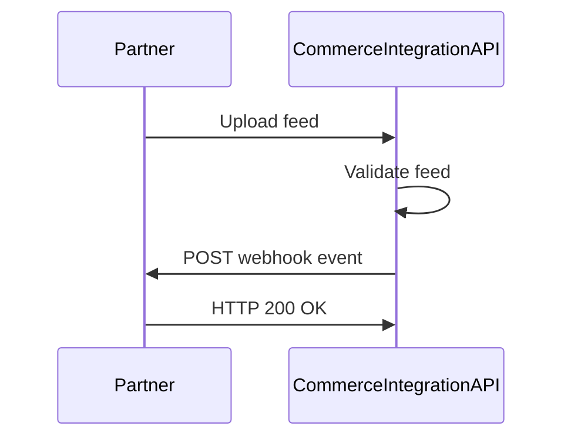

# Webhook integration guide

Use webhooks to receive event notifications when feed processing, validation, job execution, and order fulfillment activity changes in the Commerce Integration API.

Webhooks allow partner systems to receive asynchronous updates without continuously polling the API for status changes.


## How webhooks work

Webhook integrations follow this general workflow:

1. Configure a webhook endpoint in your partner system.
2. The Commerce Integration API sends HTTPS POST requests when subscribed events occur.
3. Your endpoint processes the event payload.
4. Your endpoint returns a successful `2xx` HTTP response.
5. Failed deliveries are retried automatically.




## Webhook endpoint requirements

Webhook endpoints must meet the following requirements:

- Support HTTPS
- Accept HTTP POST requests
- Accept `application/json` payloads
- Return a `2xx` response within 10 seconds
- Be publicly accessible by the Commerce Integration API


## Supported events

| Event type                    | Description                                             |
| ----------------------------- | ------------------------------------------------------- |
| `feed.uploaded`               | Triggered when a partner uploads a feed                 |
| `feed.validation.completed`   | Triggered when feed validation completes successfully   |
| `feed.validation.failed`      | Triggered when feed validation fails                    |
| `job.completed`               | Triggered when a processing job completes successfully  |
| `job.failed`                  | Triggered when a processing job fails                   |
| `order.created`               | Triggered when an order is created                      |
| `order.fulfillment.queued`    | Triggered when an order fulfillment job is queued       |
| `order.fulfillment.completed` | Triggered when order fulfillment completes successfully |
| `order.fulfillment.failed`    | Triggered when order fulfillment fails                  |


## Event payload format

All webhook events use a common payload structure.

### Fields

| Field         | Type   | Description                             |
| ------------- | ------ | --------------------------------------- |
| `event_id`    | string | Unique identifier for the webhook event |
| `event_type`  | string | Type of event that occurred             |
| `occurred_at` | string | UTC timestamp when the event occurred   |
| `data`        | object | Event-specific payload data             |

### Example payload

```json
{
  "event_id": "evt_01JX92ABCD",
  "event_type": "feed.validation.completed",
  "occurred_at": "2026-05-15T18:22:11Z",
  "data": {
    "feed_id": "FD00021",
    "partner_name": "RayTech Corp.",
    "validation_job_id": "JV00021",
    "status": "completed"
  }
}
```


## Feed validation completed event

Triggered when feed validation completes successfully.

### Example payload

```json
{
  "event_id": "evt_01JX92ABCD",
  "event_type": "feed.validation.completed",
  "occurred_at": "2026-05-15T18:22:11Z",
  "data": {
    "feed_id": "FD00021",
    "partner_name": "RayTech Corp.",
    "validation_job_id": "JV00021",
    "status": "completed",
    "valid_records": 1250,
    "invalid_records": 3
  }
}
```

### Data fields

| Field               | Description                      |
| ------------------- | -------------------------------- |
| `feed_id`           | Feed identifier                  |
| `partner_name`      | Partner associated with the feed |
| `validation_job_id` | Validation job identifier        |
| `status`            | Validation status                |
| `valid_records`     | Number of valid records          |
| `invalid_records`   | Number of invalid records        |


## Feed validation failed event

Triggered when feed validation fails.

### Example payload

```json
{
  "event_id": "evt_01JX92ABCE",
  "event_type": "feed.validation.failed",
  "occurred_at": "2026-05-15T18:30:42Z",
  "data": {
    "feed_id": "FD00022",
    "partner_name": "RayTech Corp.",
    "validation_job_id": "JV00022",
    "status": "failed",
    "error_message": "Required column 'sku' missing from CSV file."
  }
}
```

### Data fields

| Field               | Description                           |
| ------------------- | ------------------------------------- |
| `feed_id`           | Feed identifier                       |
| `partner_name`      | Partner associated with the feed      |
| `validation_job_id` | Validation job identifier             |
| `status`            | Validation status                     |
| `error_message`     | Description of the validation failure |


## Job failed event

Triggered when a processing job fails.

### Example payload

```json
{
  "event_id": "evt_01JX92ABCF",
  "event_type": "job.failed",
  "occurred_at": "2026-05-15T18:41:03Z",
  "data": {
    "job_id": "JS00031",
    "job_type": "etl_processing",
    "status": "failed",
    "message": "Database connection timeout during product update."
  }
}
```

### Data fields

| Field      | Description            |
| ---------- | ---------------------- |
| `job_id`   | Job identifier         |
| `job_type` | Type of processing job |
| `status`   | Job status             |
| `message`  | Failure message        |


## Order fulfillment completed event

Triggered when order fulfillment completes successfully.

### Example payload

```json
{
  "event_id": "evt_01JX92ABCG",
  "event_type": "order.fulfillment.completed",
  "occurred_at": "2026-05-15T19:02:55Z",
  "data": {
    "order_id": "OR00014",
    "fulfillment_job_id": "JF00014",
    "status": "completed",
    "tracking_number": "1Z999AA10123456784"
  }
}
```

### Data fields

| Field                | Description                |
| -------------------- | -------------------------- |
| `order_id`           | Order identifier           |
| `fulfillment_job_id` | Fulfillment job identifier |
| `status`             | Fulfillment status         |
| `tracking_number`    | Shipment tracking number   |


## Delivery behavior

The Commerce Integration API delivers webhook events using HTTPS POST requests.

### Delivery characteristics

- Delivery order is not guaranteed
- Duplicate event deliveries may occur
- Events should be processed asynchronously by the receiving system
- Endpoints must return a `2xx` response within 10 seconds
- Non-success responses trigger automatic retries


## Retry behavior

Webhook delivery retries occur when the receiving endpoint returns a non-`2xx` response or fails to respond within the timeout window.

### Retry schedule

| Attempt | Delay      |
| ------- | ---------- |
| 1       | Immediate  |
| 2       | 1 minute   |
| 3       | 5 minutes  |
| 4       | 15 minutes |

After the final retry attempt fails, the event delivery is marked as failed.


## Verify webhook signatures

Webhook requests include a signature header that can be used to verify that requests originated from the Commerce Integration API.

### Signature header

```text
X-Commerce-Signature: sha256=5f2c6ab4...
```

### Signature verification workflow

1. Retrieve the raw request body.
2. Generate an HMAC-SHA256 signature using your shared webhook secret.
3. Compare the generated signature to the value in the `X-Commerce-Signature` header.
4. Reject requests with invalid signatures.

Webhook signature validation helps prevent spoofed webhook requests.


## Respond to webhook requests

Webhook endpoints should return a successful HTTP response after validating and accepting the event payload.

### Example response

```http
HTTP/1.1 200 OK
Content-Type: application/json
```

```json
{
  "status": "received"
}
```


## Idempotency considerations

Webhook endpoints should support idempotent event processing.

Because duplicate event deliveries may occur, consuming systems should track processed `event_id` values and ignore duplicate events.


## Troubleshooting webhooks

### Endpoint returns HTTP 500

Verify that the webhook endpoint can successfully parse incoming JSON payloads and process requests within the timeout window.

### Duplicate events received

Duplicate deliveries may occur during retry operations. Ensure that event processing is idempotent.

### Signature validation failed

Verify that:

- The correct webhook secret is being used
- The raw request body is used during signature generation
- The HMAC-SHA256 algorithm is configured correctly

### Events are delayed

Temporary delivery delays may occur during retry operations or downstream processing interruptions.


## Related resources

- [Feeds API](feeds.md)
- [Jobs API](jobs.md)
- [Orders API](orders.md)
- [Integrate with the Commerce Integration API](integration-guide.md)