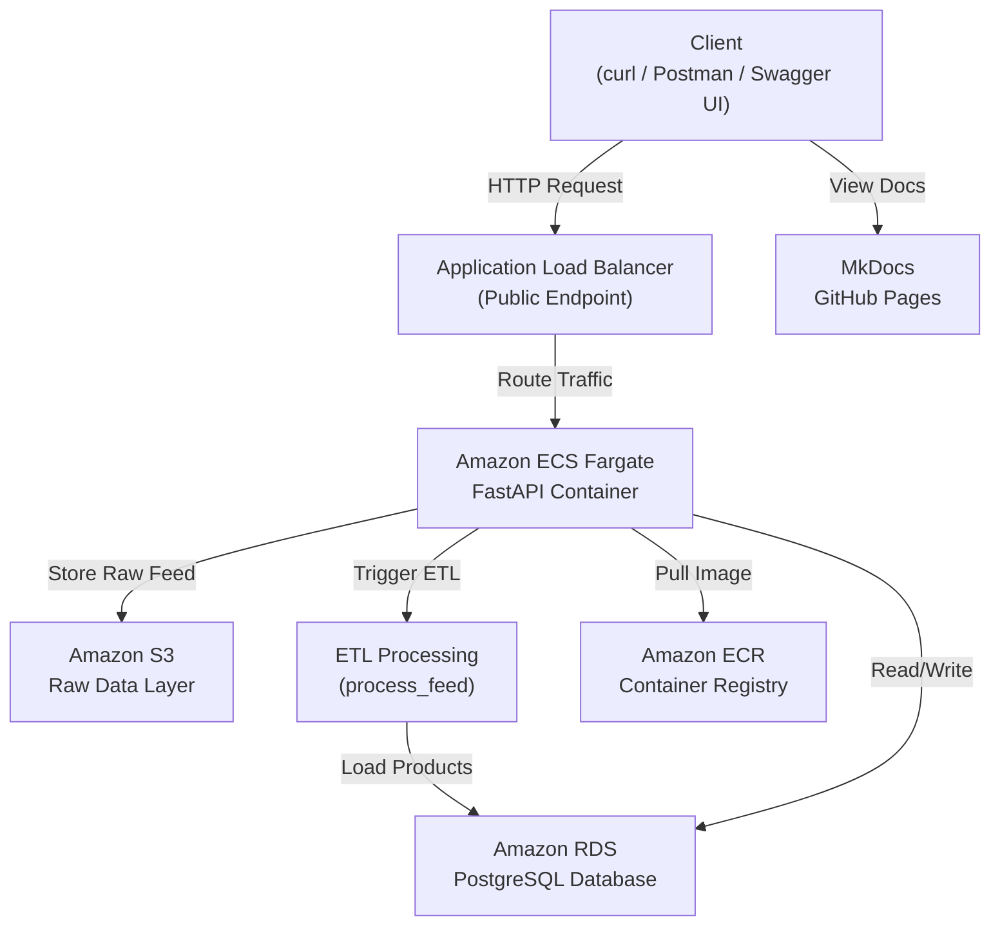

# Architecture

This document describes the high-level architecture of the Partner Catalog API, including its components, data flow, and key design decisions.

---

## System Overview

The Partner Catalog API is a layered REST application designed to:

* Ingest partner product feeds (CSV)
* Store raw feed data in Amazon S3
* Track processing using job resources
* Execute ETL processing to transform and load data
* Persist structured product data in a relational database
* Expose product data through queryable endpoints

The system models a real-world ingestion pipeline with clear separation between raw data storage, processing, and serving layers.

---

## Architecture Diagram

The following diagram illustrates the high-level system architecture and request flow:



This architecture separates compute, storage, and networking concerns while introducing a dedicated raw data layer and processing pipeline.

---

## Architecture Layers

```text
Client (curl / Postman / Swagger UI)
        ↓
Router Layer (FastAPI endpoints)
        ↓
Application / Service Layer (ETL, S3 integration)
        ↓
Data Access Layer (db.py)
        ↓
Storage Layer:
  - Amazon S3 (raw data)
  - PostgreSQL (processed data)
```

---

## Router Layer (`routers/`)

The router layer handles HTTP interactions and orchestrates application behavior.

Responsibilities:

* Request/response handling
* Input validation using FastAPI and Pydantic
* API key authentication
* Triggering job execution and ETL processing
* Routing requests to the data and service layers

Example endpoints:

* `POST /feeds/upload`
* `GET /feeds/{feed_id}`
* `GET /jobs/{job_id}`
* `POST /jobs/{job_id}/run`
* `GET /products`

---

## Application / Service Layer

This layer contains processing logic and integrations.

Responsibilities:

* ETL processing (`etl/process_feed.py`)

  * Extract data from S3
  * Transform and clean CSV data
  * Load into PostgreSQL
* S3 integration for raw file storage
* Job status updates and pipeline coordination

This layer separates processing logic from HTTP and persistence concerns.

---

## Data Access Layer (`db.py`)

This layer encapsulates all database interactions.

Responsibilities:

* Managing database connections (SQLite for local, PostgreSQL in production)
* Performing CRUD operations
* Generating structured identifiers
* Supporting filtering, sorting, and pagination
* Mapping database records to API response schemas

---

## Storage Layer

### Amazon S3 (Raw Data Layer)

* Stores uploaded CSV files
* Acts as the system of record for raw partner data
* Enables reprocessing and auditability

Example object key:

```text
raw/partners/{partner_name}/feeds/{feed_id}/{filename}.csv
```

---

### PostgreSQL (Processed Data Layer)

Stores normalized and queryable data.

Core tables:

* `feeds`
* `jobs`
* `products`
* `id_counters`

---

## Data Flow

### Feed Ingestion Workflow

```text
Client
  ↓
POST /feeds/upload
  ↓
Validate CSV structure
  ↓
Store raw file in S3
  ↓
Generate IDs (FDxxxxx, JSxxxxx, JVxxxxx)
  ↓
Persist feed metadata
  ↓
Create submission + validation jobs
  ↓
Return response (no ingestion yet)
```

---

### ETL Processing Workflow

```text
POST /jobs/{job_id}/run
  ↓
Fetch feed metadata (S3 key + bucket)
  ↓
Read CSV from S3
  ↓
Clean and transform data
  ↓
Insert into products table
  ↓
Update job status and message
```

---

### Product Query Workflow

```text
Client
  ↓
GET /products
  ↓
Apply filters, sorting, pagination
  ↓
Query database
  ↓
Map DB fields → API response schema
  ↓
Return response (items + next_cursor)
```

---

## Identifier Strategy

The API uses structured identifiers to ensure traceability.

| Prefix | Resource       | Example |
|--------|----------------|---------|
| FD     | Feed           | FD00001 |
| JS     | Submission Job | JS00001 |
| JV     | Validation Job | JV00001 |
| PR     | Product        | PR00001 |

Identifiers are generated using a database-backed counter.

---

## Job Model

Each feed submission generates two job resources:

### Submission Job (`JSxxxxx`)

* Tracks feed upload processing
* Typically completes immediately

### Validation Job (`JVxxxxx`)

* Executes ETL processing
* Reads raw data from S3
* Transforms and loads product data into PostgreSQL
* Updates job status and ingestion results

Jobs are executed via:

```text
POST /jobs/{job_id}/run
```

---

## Job Lifecycle

```text
queued → running → completed
                ↘ failed
```

| Status    | Description                        |
|-----------|------------------------------------|
| queued    | Job created and awaiting execution |
| running   | ETL processing in progress         |
| completed | Job finished successfully          |
| failed    | Job encountered an error           |

---

## Data Mapping Strategy

The system separates internal storage models from API representations.

| Layer        | Field Name  |
|--------------|-------------|
| Database     | `filename`  |
| API Response | `file_name` |

This approach:

* Maintains consistent API naming conventions
* Allows internal schema flexibility
* Decouples storage from presentation

---

## Deployment Architecture (AWS)

The application is deployed using a container-based architecture:

* **Amazon ECS Fargate** runs the FastAPI application
* **Amazon RDS (PostgreSQL)** provides persistent storage
* **Amazon S3** stores raw feed data
* **Application Load Balancer (ALB)** exposes a public endpoint
* **Amazon ECR** stores container images

---

## Reliability and Health Monitoring

* ECS maintains desired task count
* ALB performs health checks
* Failed containers are automatically replaced
* Database availability is managed by RDS

---

## Documentation and Developer Experience

* Swagger UI (`/docs`) for interactive API exploration
* MkDocs static documentation hosted on GitHub Pages
* Consistent request/response formats for ease of use

---

## Design Decisions

### Separation of Concerns

* Router layer handles HTTP
* Service layer handles ETL and integrations
* Data layer handles persistence
* Storage layers separate raw and processed data

---

### Raw vs Processed Data Separation

* S3 stores immutable raw data
* PostgreSQL stores normalized queryable data

This enables reprocessing, auditing, and scalability.

---

### Controlled Job Execution

* Jobs are triggered via API
* Execution is synchronous (current state)
* Designed for future async processing

---

### Cursor-Based Pagination

* Uses `product_id` as cursor
* Avoids offset performance issues
* Scales efficiently with large datasets

---

### Cloud-Native Deployment

* Containerized application (Docker)
* Serverless compute (ECS Fargate)
* Managed storage (S3 + RDS)
* Load-balanced public access (ALB)

---

## Future Enhancements

* Asynchronous job processing (queues/workers)
* Event-driven ingestion pipelines
* Advanced validation rules
* Horizontal scaling with multiple workers
* Read replicas for database scaling
* Infrastructure as Code (Terraform / CloudFormation)

---

## Project Structure

```text
app/
  main.py
  db.py
  security.py
  settings.py
  routers/
    feeds.py
    jobs.py
    products.py
  schemas/
    feeds.py
    jobs.py
    products.py
    common.py
  etl/
    process_feed.py
  services/
    s3_service.py
  docs/
    *.md
```

---

## Related Documentation

* [Index](index.md)
* [Feeds API](feeds.md)
* [Jobs API](jobs.md)
* [Products API](products.md)
* [Workflows](workflows.md)
* [Errors](errors.md)

For deployment evidence, see [Screenshots](screenshots.md).
