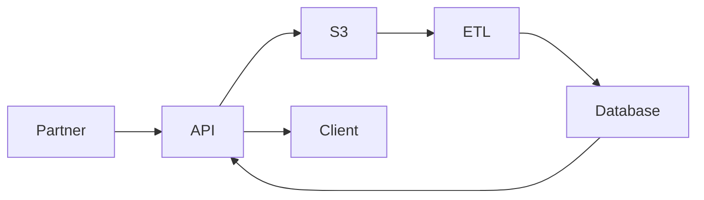

# Architecture and integration

## System overview

This page explains how the Commerce Integration API ingests, processes, and serves partner product data.

---

## Architecture goals

- Enable scalable partner data ingestion
- Support asynchronous processing of large datasets
- Ensure data integrity and traceability
- Provide reliable access to processed product data
- Reduce operational overhead through structured workflows

---

## High-level architecture

The platform consists of the following core components:

- **API Layer (FastAPI)** — Handles incoming requests and exposes endpoints
- **Storage Layer (Amazon S3)** — Stores raw partner feed files
- **Processing Layer (ETL Pipeline)** — Validates and transforms data
- **Database Layer (PostgreSQL)** — Stores structured product data
- **Compute & Hosting (AWS ECS / Fargate)** — Runs application services
- **Load Balancer (ALB)** — Routes external traffic to the API

---

## Data flow overview

### 1. Feed submission

- Partner uploads a CSV file via the `/feeds/upload` endpoint
- API stores the raw file in S3 for durability and traceability
- A feed record is created in the database
- A validation job (`JVxxxxx`) is queued

---

### 2. Asynchronous processing

- ETL processing runs in the background
- File is retrieved from S3
- Data is parsed and validated

Validation includes:

- Required field checks (`sku`, `product_name`)
- Data type validation
- Structural consistency

---

### 3. Data transformation

- Valid records are normalized into system schema
- Product uniqueness enforced using `(partner_name, sku)`
- Existing records are compared for changes

Processing results:

- **Inserted** — New product created
- **Updated** — Existing product changed
- **Unchanged** — No data changes detected
- **Skipped** — Invalid or incomplete records

---

### 4. Data persistence

- Processed data is stored in PostgreSQL
- Feed metadata updated with validation results
- Job status updated to reflect completion

---

### 5. Data access

- Clients retrieve data via `/products` endpoint
- Supports filtering, sorting, and pagination
- Cursor-based pagination used for scalable access

---

## System interaction diagram

---

## Key integration points

### API ↔ S3

- Raw files stored for replay and auditing
- Enables reprocessing without re-upload

---

### API ↔ ETL

- Job-based trigger mechanism
- Background processing decouples ingestion from validation

---

### ETL ↔ Database

- Inserts and updates product records
- Enforces data consistency rules

---

### API ↔ Database

- Serves processed data to clients
- Applies filters and pagination logic

---

## Design considerations

### Asynchronous processing

- Prevents blocking during large file uploads
- Improves system responsiveness
- Enables scalable ingestion

---

### Idempotent data handling

- Reprocessing the same feed does not create duplicates
- Change detection ensures accurate update counts

---

### Traceability

- Raw files stored in S3 with structured keys
- Feed and job metadata retained for auditability

---

### Scalability

- ECS Fargate enables horizontal scaling
- Pagination prevents large query loads
- Decoupled components support growth

---

## Failure handling

### Validation failures

- Invalid rows skipped during processing
- Errors reflected in job summary

---

### Processing errors

- Job status marked as `failed`
- Logs used for root cause analysis

---

### Data integrity issues

- Duplicate prevention enforced at ingestion
- Required field validation ensures minimum data quality

---

## Observability

- Job status endpoints provide visibility into processing
- ETL summaries expose ingestion results
- Logs support troubleshooting and auditing

---

## Security considerations

- API access controlled via API key
- Data validation prevents malformed input
- Sensitive data handling aligned with secure practices

---

## Related documentation

- [API Documentation](../api/index.md)
- [SOP](../sop/onboarding.md)
- [Incident Response](../security/incident-response.md)`

---