# Integration guide

Use this guide to build a commerce data integration workflow using the Commerce Integration API.

The platform supports ingestion-driven commerce workflows using ETL processing, asynchronous job execution, partner, customer and order management workflows, analytics aggregation, and cloud-native infrastructure patterns.

  Partner integration
  REST
  JSON
  Workflow guide

## Overview

The Commerce Integration API supports the following integration workflow:

1. Create a partner
2. Prepare a partner product feed
3. Upload the feed using the partner ID
4. Monitor validation and ETL processing
5. Query product data
6. Create fictional customer and shipping address records
7. Create and retrieve order data
8. Retrieve analytics data

## When to use this guide

Use this guide to design, implement, or document a repeatable commerce data integration workflow.

This guide explains how ingestion, ETL, catalog retrieval, customer workflows, order processing, and analytics workflows interact across the platform.

For a step-by-step walkthrough of a single feed upload, see [Ingest a product feed](../how-to/ingest-product-feed.md).

For complete endpoint details, see:

- [Feeds](../api/feeds.md)
- [Jobs](../api/jobs.md)
- [Products](../api/products.md)
- [Customers](../api/customers.md)
- [Orders](../api/orders.md)
- [Analytics](../api/analytics.md)

## Integration architecture

The Commerce Integration API uses an asynchronous ingestion pipeline designed to support large partner product feeds and long-running processing workflows.

When a partner integration is configured:

1. A partner record is created
2. A unique partner ID (`PTxxxxx`) is assigned
3. The partner uploads a feed using the partner ID
4. The raw CSV file is stored in Amazon S3
5. A feed record is created
6. Submission and validation jobs are created
7. ETL processing transforms and loads product data into PostgreSQL
8. Products become available through query endpoints
9. Fictional customer and shipping address records can be created
10. Orders can be created from catalog products
11. Analytics endpoints aggregate transactional data

## Asynchronous processing

Feed ingestion occurs asynchronously. Uploading a feed does not immediately make products available in the catalog.

Integrations should:

- Track validation and ETL status
- Handle delayed processing
- Retry failed operations when appropriate
- Avoid assuming immediate catalog availability after upload

!!! note "Eventual consistency"

    Product data may not be immediately available after feed upload because validation and ETL processing occur asynchronously.

## Scalability considerations

The ingestion pipeline is designed to support scalable commerce data processing across multiple partner integrations and large product catalogs.

Key characteristics include:

- Asynchronous ingestion workflows
- Independent validation and ETL processing
- Support for large batch product feeds
- Incremental catalog update workflows
- Replay support for failed processing operations
- Decoupled storage and processing layers

## Integration design

Before implementing a partner integration, define how product feeds will be generated, validated, monitored, and consumed by downstream systems.

### Partner onboarding

Before a partner can submit product feeds, a partner record must be created through the Partners API.

Each partner is assigned a unique identifier using the `PTxxxxx` format. Feed uploads reference the partner by ID rather than partner name to provide consistent identification across ingestion, catalog, operational, and analytics workflows.

Recommended onboarding activities include:

- Creating the partner record
- Verifying partner contact information
- Defining feed format requirements
- Validating sample feed files
- Confirming upload and monitoring procedures

Partner IDs should be treated as the system-of-record identifier for all integration workflows.

### Feed delivery

Determine how partners will provide catalog updates.

Common approaches include:

- Full catalog feeds submitted on a schedule
- Incremental feeds containing only changed products
- Event-driven uploads triggered by inventory or pricing changes

Large catalogs may require batching or scheduled uploads to reduce processing overhead.

### Data validation

Validate feed files before upload whenever possible.

Recommended validations include:

- Required header verification
- CSV format validation
- Duplicate SKU detection
- Price and currency formatting validation
- Availability value normalization

!!! warning "Pre-validation"

    Performing validation before upload reduces failed ETL jobs and unnecessary processing.

### Job monitoring

Because ingestion occurs asynchronously, integrations should monitor validation and ETL job status throughout processing.

Recommended practices include:

- Polling job status endpoints at scheduled intervals
- Logging failed jobs for troubleshooting
- Alerting on repeated validation or ETL failures
- Tracking processing duration for large feeds

### Product retrieval

Determine how downstream systems will retrieve product data.

For large catalogs:

- Use pagination
- Filter results whenever possible
- Avoid unnecessary full catalog retrievals
- Cache frequently requested product data when appropriate

### Order processing

Orders are created transactionally using catalog product data.

During order creation:

- Product availability is validated
- Product pricing is copied into each order item
- Line totals are calculated at order creation time
- Order totals are calculated from associated order items

!!! tip "Transactional consistency"

    Product pricing is copied into order records during order creation to preserve historical transactional accuracy.

### Customer workflows

Customer and shipping address records support transactional order workflows.

The following customer-sensitive fields are encrypted before storage:

- Email addresses
- Phone numbers
- Street addresses
- Postal codes

API responses return masked values instead of raw customer-sensitive values.

This demonstrates field-level encryption and controlled exposure of customer-sensitive data.

### Analytics

Analytics endpoints provide:

- Partner revenue reporting
- Product performance analysis
- Operational dashboards
- Feed processing reconciliation
- Sales trend analysis

Analytics endpoints aggregate data from orders, products, and transactional workflows.

## ETL processing behavior

After validation completes successfully, the ETL pipeline transforms and loads product data into the catalog database.

During processing, each product row is evaluated independently to determine whether the product should be inserted, updated, left unchanged, removed from the catalog, or skipped.

### ETL result definitions

| Result    | Description                                                                                                                        |
| --------- | ---------------------------------------------------------------------------------------------------------------------------------- |
| Inserted  | A new product was created because the partner and SKU combination did not previously exist                                         |
| Updated   | An existing product was updated because one or more fields changed                                                                 |
| Unchanged | An existing product matched the incoming data and required no update                                                               |
| Deleted   | An existing product was removed because its availability was set to `out_of_stock`                                                 |
| Skipped   | The row was not eligible for catalog insertion, such as a new product marked `out_of_stock` or a row missing required product data |

### Processing rules

The ETL pipeline applies the following rules during product ingestion:

- New products with `availability=in_stock` are inserted into the catalog
- Existing products with changed data are updated
- Existing products with no data changes remain unchanged
- Existing products with `availability=out_of_stock` are removed from the catalog
- New products with `availability=out_of_stock` are skipped
- Rows missing required product data are skipped

This behavior ensures that the product catalog contains only products that are currently available for ordering.

### Change detection

The ETL pipeline performs change detection to avoid unnecessary database updates.

For existing products, the system compares incoming values against the current catalog record. Products are updated only when one or more fields change.

Benefits include:

- Reduced database writes
- Improved processing efficiency
- Reduced downstream synchronization overhead
- More accurate update tracking

Because unchanged products are not rewritten, repeated feed submissions support idempotent processing behavior.

!!! note "Idempotent ETL behavior"

    Existing products are updated only when incoming feed data changes. Reprocessing the same feed does not create duplicate products or generate unnecessary updates.

## Error handling and resilience

Integrations should account for validation failures, ETL processing issues, malformed product data, unsupported availability values, delayed processing, and order creation failures.

Because feed ingestion is asynchronous, failures may occur after a successful upload response is returned.

### Common failure scenarios

| Scenario                  | Description                                                                  |
| ------------------------- | ---------------------------------------------------------------------------- |
| Invalid CSV format        | The uploaded file does not meet CSV formatting requirements                  |
| Missing required headers  | Required fields such as `sku`, `product_name`, or `availability` are missing |
| Invalid availability      | A product row contains an unsupported availability value                     |
| Invalid product data      | Product rows contain malformed or unsupported values                         |
| ETL processing failure    | An internal processing error prevents product ingestion                      |
| Product unavailable       | A requested product cannot be used to create an order                        |
| Missing order resource    | A requested order does not exist                                             |
| Missing customer resource | A referenced customer or shipping address does not exist                     |
| Authentication failure    | The request does not include a valid API key                                 |

### Recommended practices

Implementations should:

- Log upload, job, product, and order identifiers
- Monitor validation and ETL job status
- Retry failed uploads when appropriate
- Alert on repeated processing failures
- Retain source feed files for replay workflows
- Avoid logging raw customer-sensitive values
- Verify product availability before creating orders

### Troubleshooting

When troubleshooting failed processing:

1. Review validation job output
2. Identify invalid rows or formatting issues
3. Correct feed data issues
4. Re-upload the corrected feed
5. Verify successful ETL completion
6. Verify product availability before creating orders

For troubleshooting procedures, see [Debug a product feed failure](../operations/debug-product-feed.md).

## Related documentation

### Tutorials and workflows

- [Ingest a product feed](../how-to/ingest-product-feed.md)
- [Debug a product feed failure](../operations/debug-product-feed.md)

### Specifications and architecture

- [CSV feed file specification](../specs/csv-feed-file-spec.md)
- [System architecture](architecture.md)

## Summary

The Commerce Integration API provides a scalable ingestion, catalog management, order processing, and analytics platform for integrating external commerce data into downstream systems.

Successful integrations should account for validation workflows, ETL processing behavior, monitoring requirements, downstream product consumption, and transactional order workflows when designing production ingestion pipelines.