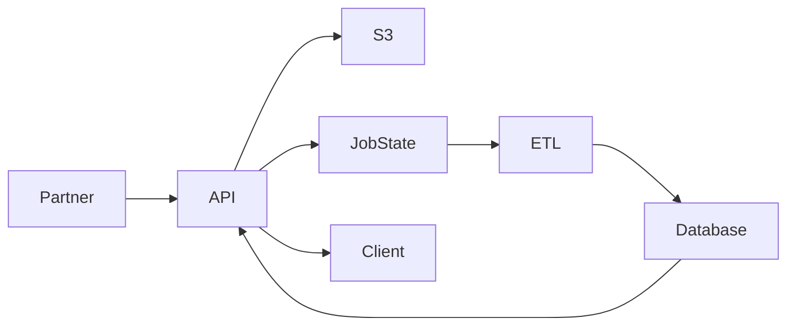

# System Architecture and Operational Flow

## System overview

This page explains how the Commerce Integration API ingests, processes, stores, and serves partner product data across asynchronous processing and operational workflows.

The platform is designed around scalable ingestion and background processing patterns, allowing large partner feeds to be validated, transformed, and processed independently of client-facing request handling.


## Architecture goals

- Enable scalable partner data ingestion
- Support asynchronous processing of large datasets
- Ensure data integrity and operational traceability
- Provide reliable access to processed product data
- Support troubleshooting and operational visibility
- Reduce operational overhead through structured workflows


## High-level architecture

The platform consists of the following core components:

- **API Layer (FastAPI)** — Handles incoming requests and exposes integration endpoints
- **Storage Layer (Amazon S3)** — Stores raw partner feed files for replay and traceability
- **Processing Layer (ETL Pipeline)** — Validates, transforms, and processes ingestion data
- **Database Layer (PostgreSQL)** — Stores normalized product and operational metadata
- **Compute & Hosting (AWS ECS / Fargate)** — Runs application and processing services
- **Load Balancer (ALB)** — Routes external traffic to the API layer


## Data flow overview

### 1. Feed submission

- Partner uploads a CSV file via the `/feeds/upload` endpoint
- API stores the raw file in Amazon S3
- A feed record is created in the database
- A validation job (`JVxxxxx`) is initialized with a `queued` status

The raw file is retained to support replay, auditing, troubleshooting, and operational recovery workflows.


### 2. Asynchronous processing

ETL processing executes independently from client-facing requests to support scalable ingestion and non-blocking upload workflows.

Processing steps include:

- Retrieving the uploaded file from S3
- Parsing and validating ingestion data
- Detecting structural and formatting issues
- Evaluating required fields and data consistency

Validation includes:

- Required field checks (`sku`, `product_name`)
- Data type validation
- Structural consistency validation
- Feed-level processing integrity checks

Operational job states include:

- `queued`
- `running`
- `completed`
- `failed`


### 3. Data transformation

Valid records are normalized into the system schema before persistence.

Transformation processing includes:

- Product normalization
- Duplicate prevention
- Change detection
- Feed-to-product association tracking

Product uniqueness is enforced using:

```text
(partner_name, sku)
```

Existing records are compared against incoming feed data to determine whether changes are required.

Processing results include:

- **Inserted** — New product created
- **Updated** — Existing product modified
- **Unchanged** — No changes detected
- **Skipped** — Invalid or incomplete record


### 4. Data persistence

Processed records are stored in PostgreSQL along with associated feed and job metadata.

Persistence workflows include:

- Product record insertion and updates
- Feed status updates
- ETL summary generation
- Job lifecycle tracking

Operational metadata is retained to support troubleshooting, auditing, and processing traceability.


### 5. Data access

Clients retrieve processed product data through API query endpoints.

Supported capabilities include:

- Filtering
- Sorting
- Cursor-based pagination
- Feed-level product retrieval
- Analytics and reporting queries

Cursor-based pagination is used to support scalable retrieval of large datasets.


## System interaction diagram




## Key integration points

### API ↔ S3

- Raw files retained for replay and operational recovery
- Enables reprocessing without requiring file re-upload
- Supports ingestion traceability and auditing workflows

### API ↔ ETL

- Job-based processing model decouples ingestion from validation and transformation
- Background processing improves responsiveness during large uploads
- Job lifecycle states provide operational visibility

### ETL ↔ Database

- Inserts and updates normalized product records
- Applies validation and consistency rules
- Maintains processing summaries and operational metadata

### API ↔ Database

- Serves processed product and analytics data
- Applies filtering, sorting, and pagination logic
- Exposes operational status and ingestion results


## Design considerations

### Asynchronous processing

- Prevents blocking during large uploads
- Improves client responsiveness
- Supports scalable ingestion workflows

### Idempotent data handling

- Reprocessing the same feed does not create duplicate records
- Change detection prevents unnecessary updates

### Operational traceability

- Raw files retained in S3 using structured storage paths
- Feed and job metadata preserved throughout ingestion lifecycle
- Processing summaries support operational analysis

### Scalability

- ECS Fargate supports horizontal application scaling
- Decoupled processing components support workload growth
- Cursor-based pagination reduces large query overhead


## Failure handling

### Validation failures

- Invalid records skipped during ingestion
- Validation issues reflected in processing summaries
- Feed-level integrity checks prevent malformed ingestion workflows

### Processing failures

- Job status updated to `failed`
- Processing logs support troubleshooting and root cause analysis
- Operational metadata retained for recovery workflows

### Recovery workflows

- Failed jobs can be replayed without requiring feed re-upload
- Raw S3 files retained for reprocessing and troubleshooting
- Job metadata enables lifecycle traceability across ingestion events

### Data integrity protections

- Duplicate prevention enforced during ingestion
- Required field validation ensures minimum data quality
- Transformation workflows enforce schema consistency


## Observability

Operational visibility is provided through job tracking, processing summaries, and structured system metadata.

Observability features include:

- Job lifecycle tracking (`queued`, `running`, `completed`, `failed`)
- ETL processing summaries
- Validation result visibility
- Feed-level operational metadata
- Structured logs supporting troubleshooting and auditing workflows


## Security considerations

- API access controlled through API key authentication
- Input validation prevents malformed ingestion data
- Raw feed storage supports controlled operational traceability
- Sensitive data handling aligned with secure processing practices


## Related documentation

- [API Documentation](../api/index.md)
- [Integration Guide](../api/integration-guide.md)
- [SOP](../operations/onboarding.md)
- [Incident Response](../security/incident-response.md)