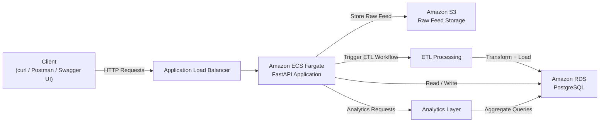
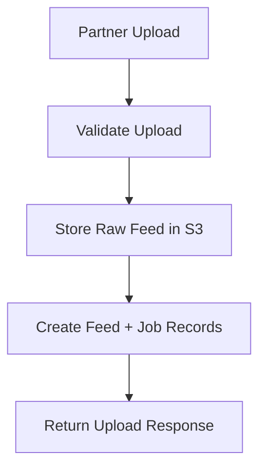
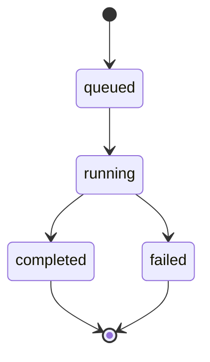
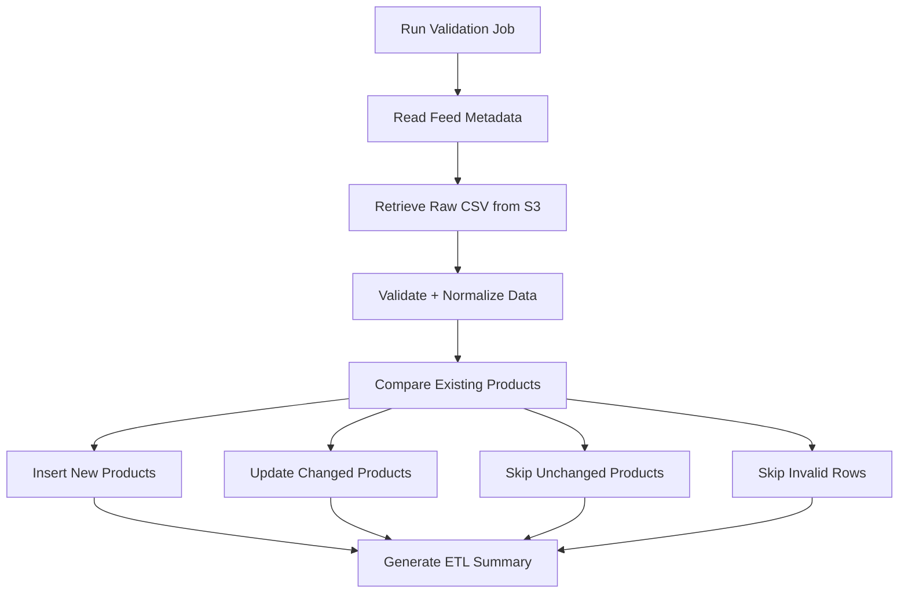
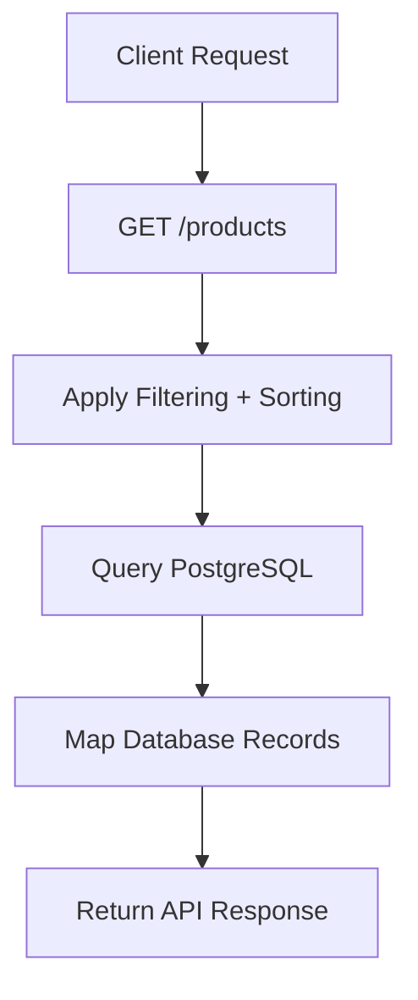

# Platform architecture and operational flow

This page explains how the Commerce Integration API ingests, processes, stores, and serves partner product data across ingestion, ETL, and operational workflows.

The platform is designed around a job-based ingestion model that separates feed submission, processing, storage, and data access responsibilities.


## Platform goals

The architecture is designed to:

- Support scalable partner feed ingestion
- Separate raw and processed data layers
- Provide operational visibility through job tracking
- Enable reliable ETL processing workflows
- Support troubleshooting and feed reprocessing
- Expose normalized product and analytics data through APIs


## Platform overview

The Commerce Integration API consists of the following core layers:

| Layer                | Responsibility                                               |
| -------------------- | ------------------------------------------------------------ |
| API Layer            | Handles HTTP requests and integration workflows              |
| Raw Data Layer       | Stores uploaded partner feed files in Amazon S3              |
| Processing Layer     | Executes validation and ETL workflows                        |
| Data Layer           | Stores normalized product and operational data in PostgreSQL |
| Analytics Layer      | Provides aggregated reporting and operational metrics        |
| Infrastructure Layer | Hosts and routes application traffic through AWS services    |


## High-level architecture




## Core workflow

The platform follows a multi-stage ingestion and processing workflow.

### 1. Feed submission

Partners upload CSV product feeds through the Feeds API.

```text
POST /feeds/upload
```

During upload:

- Feed metadata is validated
- The raw CSV file is stored in Amazon S3
- Feed records are persisted in PostgreSQL
- Submission and validation jobs are created

The raw uploaded file remains stored in S3 to support replay, auditing, troubleshooting, and operational traceability.


## Feed processing workflow



### Generated identifiers

| Resource       | Prefix | Example   |
| -------------- | ------ | --------- |
| Feed           | `FD`   | `FD00001` |
| Submission Job | `JS`   | `JS00001` |
| Validation Job | `JV`   | `JV00001` |
| Product        | `PR`   | `PR00001` |


## Job-based processing

The platform models ingestion workflows through explicit job resources.

Validation and ETL processing are triggered through the Jobs API:

```text
POST /jobs/{job_id}/run
```

This design separates ingestion workflows from client-facing upload operations while providing operational visibility into processing state and ETL results.


## Job lifecycle



| Status      | Description                        |
| ----------- | ---------------------------------- |
| `queued`    | Job created and awaiting execution |
| `running`   | Processing currently executing     |
| `completed` | Processing completed successfully  |
| `failed`    | Processing encountered an error    |


## ETL processing workflow

The ETL pipeline extracts uploaded feed data, validates records, normalizes product information, and persists processed records to PostgreSQL.

### ETL workflow



### Validation behavior

Validation includes:

- Required field checks
- CSV structure validation
- Data normalization
- Product uniqueness validation
- Feed integrity validation

Minimum required fields:

```text
sku
product_name
```


## Change detection and idempotency

The ETL pipeline uses change detection to avoid unnecessary updates.

| Result    | Description                |
| --------- | -------------------------- |
| Inserted  | New product created        |
| Updated   | Existing product changed   |
| Unchanged | Existing product identical |
| Skipped   | Invalid or incomplete row  |

Product uniqueness is enforced using:

```text
(partner_name, sku)
```

This design supports:

- Idempotent processing
- Efficient reprocessing
- Reduced database writes
- Reliable synchronization behavior


## Storage architecture

The platform separates raw and processed data layers.

### Amazon S3 (Raw data layer)

Amazon S3 stores uploaded CSV feed files.

Responsibilities include:

- Raw feed retention
- Reprocessing support
- Operational recovery
- Auditability
- Feed traceability

Example object key:

```text
raw/partners/{partner_name}/feeds/{feed_id}/{filename}.csv
```

### PostgreSQL (Processed data layer)

PostgreSQL stores normalized and queryable data.

Core tables include:

- `feeds`
- `jobs`
- `products`
- `orders`
- `id_counters`


## Product access workflows

Clients retrieve processed product data through query endpoints.

Supported capabilities include:

- Filtering
- Sorting
- Cursor-based pagination
- Feed-level product retrieval
- Analytics queries

### Product query workflow




## Analytics workflows

The analytics layer provides aggregated reporting across processed order and product data.

Example analytics include:

- Revenue by partner
- Sales trends over time
- Revenue share distribution
- Order analytics
- Product-level reporting

Analytics endpoints operate exclusively on processed PostgreSQL data.


## Operational visibility

Operational metadata is retained throughout ingestion and processing workflows.

The platform provides:

- Job lifecycle tracking
- ETL summaries
- Feed-level traceability
- Validation status visibility
- Structured processing metadata

This supports troubleshooting, replay workflows, and operational analysis.


## Failure handling

### Validation failures

- Invalid rows are skipped during processing
- Validation issues appear in ETL summaries
- Feed processing continues for valid rows when possible

### Processing failures

- Job status transitions to `failed`
- Processing metadata is retained
- Raw feed data remains available in S3 for replay

### Recovery workflows

- Failed jobs can be re-run
- Raw uploaded feeds remain available for reprocessing
- Processing history remains traceable through job records


## Deployment model

The Commerce Integration API uses a containerized AWS deployment architecture.

Core infrastructure components include:

- FastAPI application running in Docker containers
- Amazon ECS (Fargate) for container orchestration
- Amazon ECR for image storage
- Application Load Balancer for public routing
- Amazon RDS for relational storage
- Amazon S3 for raw feed storage


## Design decisions

### Separation of raw and processed data

The platform separates ingestion storage from queryable product storage.

Benefits include:

- Safer reprocessing workflows
- Improved auditability
- Reduced processing risk
- Operational traceability

### Explicit job-based execution

ETL processing is modeled as an explicit operational workflow rather than automatic inline execution.

This approach provides:

- Better operational visibility
- Clear lifecycle management
- Improved troubleshooting support
- Flexible future migration to worker-based architectures

### Cursor-based pagination

The Products API uses cursor-based pagination to support scalable retrieval of large datasets.

This avoids the performance limitations associated with large offset-based queries.


## Future enhancements

Potential future improvements include:

- Dedicated asynchronous worker infrastructure
- Queue-based ETL orchestration
- Event-driven ingestion workflows
- Advanced validation pipelines
- Read replicas for analytics scaling
- Infrastructure as Code (Terraform / CloudFormation)


## Related documentation

- [Architecture](../api/architecture.md)
- [Deployment guide](deployment.md)
- [Feeds API](../api/feeds.md)
- [Jobs API](../api/jobs.md)
- [Products API](../api/products.md)
- [Orders API](../api/orders.md)
- [Analytics API](../api/analytics.md)
- [Integration guide](../api/integration-guide.md)
- [Workflows](../architecture/workflows.md)

For deployment evidence, see [Screenshots](../api/screenshots.md).