# Platform architecture and operational flow

This page explains how the Commerce Integration API ingests, processes, stores, and serves partner product data across operational workflows.

The platform is designed around a job-based ingestion model that separates feed submission, processing, storage, and data access responsibilities.

<div class="doc-meta">
  <span>Operational workflows</span>
  <span>Async processing</span>
  <span>Data pipelines</span>
  <span>Cloud-native services</span>
</div>

## Platform goals

The platform is designed to:

- Support partner feed ingestion workflows
- Separate raw and processed data layers
- Provide operational visibility through job tracking
- Enable repeatable ETL processing
- Support troubleshooting and feed reprocessing
- Support customer and order fulfillment workflows
- Demonstrate field-level encryption and masked API responses
- Expose processed product and analytics data through APIs


## Platform overview

The Commerce Integration API consists of the following core layers:

| Layer                | Responsibility                                                                 |
| -------------------- | ------------------------------------------------------------------------------ |
| API layer            | Handles HTTP requests and integration workflows                                |
| Raw data layer       | Stores uploaded partner feed files in Amazon S3                                |
| Processing layer     | Executes validation and ETL workflows                                          |
| Data layer           | Stores normalized product, customer, order, and operational data in PostgreSQL |
| Analytics layer      | Provides aggregated reporting and operational metrics                          |
| Infrastructure layer | Hosts and routes application traffic through AWS services                      |


## High-level architecture

<div class="diagram-card" markdown="1">

</div>

## Operational workflow

The platform follows a multi-stage ingestion and processing workflow.

### Feed submission

Partners upload CSV product feeds through the Feeds API.

```text
POST /feeds/upload
```

During upload:

- Feed metadata is validated
- The raw CSV file is stored in Amazon S3
- Feed records are persisted in PostgreSQL
- Submission and validation jobs are created

The raw uploaded file remains stored in S3 to support replay, auditing, troubleshooting, and operational traceability.


### Job-based processing

Validation and ETL processing are triggered through the Jobs API.

```text
POST /jobs/{job_id}/run
```

This design separates feed submission from processing execution while providing visibility into job state and processing results.


### Data access

Clients retrieve processed product and analytics data through API endpoints.

Read operations operate on processed PostgreSQL data. Because ingestion and processing are separate workflows, read operations may reflect the last completed ETL run until processing completes.

### Customer and order workflows

Customer and shipping address records support transactional order workflows.

Sensitive customer fields including:

- Email addresses
- Phone numbers
- Street addresses
- Postal codes

are encrypted before storage.

API responses return masked values instead of raw sensitive values.

Orders can optionally reference:

```text
customer_id
shipping_address_id
```

This design demonstrates field-level encryption and controlled exposure of PII-like data within commerce transaction workflows.

## Job lifecycle

| Status      | Description                        |
| ----------- | ---------------------------------- |
| `queued`    | Job created and awaiting execution |
| `running`   | Processing currently executing     |
| `completed` | Processing completed successfully  |
| `failed`    | Processing encountered an error    |


## Operational traceability

Operational metadata is retained throughout ingestion and processing workflows.

The platform tracks:

- Feed identifiers
- Job identifiers
- Customer and order identifiers
- Processing status
- ETL execution summaries
- Validation results
- Feed processing timestamps

This supports troubleshooting, replay workflows, and audit-oriented operational analysis.


## Change detection and idempotency

The ETL pipeline uses change detection to avoid unnecessary database updates.

| Result    | Description                |
| --------- | -------------------------- |
| Inserted  | New product created        |
| Updated   | Existing product changed   |
| Unchanged | Existing product identical |
| Skipped   | Invalid or incomplete row  |

Product uniqueness is enforced using:

```text
(partner_name, sku)
```

This design supports:

- Idempotent processing
- Efficient reprocessing
- Reduced database writes
- Reliable synchronization behavior


## Storage model

The platform separates raw and processed data.

### Amazon S3

Amazon S3 stores uploaded CSV feed files.

Responsibilities include:

- Raw feed retention
- Reprocessing support
- Operational recovery
- Auditability
- Feed traceability

Example object key:

```text
raw/partners/{partner_name}/feeds/{feed_id}/{filename}.csv
```

### PostgreSQL

PostgreSQL stores normalized and queryable data.

Core tables include:

- `feeds`
- `jobs`
- `products`
- `customers`
- `customer_addresses`
- `orders`
- `order_items`
- `id_counters`


## Analytics workflows

The analytics layer provides aggregated reporting across processed product, customer-linked order, and transactional workflow data.

Example analytics include:

- Revenue by partner
- Sales trends over time
- Revenue share distribution
- Order analytics
- Product-level reporting

Analytics endpoints operate exclusively on processed PostgreSQL data.


## Failure handling

### Validation failures

- Invalid rows are skipped during processing
- Validation issues appear in ETL summaries
- Invalid customer or shipping references can prevent downstream order creation
- Feed processing continues for valid rows when possible

### Processing failures

- Job status transitions to `failed`
- Processing metadata is retained
- Raw feed data remains available in S3 for replay

### Recovery workflows

- Failed jobs can be re-run
- Raw uploaded feeds remain available for reprocessing
- Processing history remains traceable through job records


## Design decisions

### Separate feed submission from processing

Feed upload and ETL execution are separate workflow steps.

This supports:

- Clear operational control
- Job-based visibility
- Easier troubleshooting
- Future migration to worker-based processing

### Retain raw feed data

Raw uploaded feeds are retained in S3.

This supports:

- Reprocessing
- Auditability
- Recovery workflows
- Traceability across ingestion events

### Track processing through jobs

Processing state is represented through explicit job resources.

This provides:

- Status visibility
- ETL result tracking
- Operational accountability
- Troubleshooting context

### Encrypt customer-sensitive data

Customer-sensitive fields are encrypted before storage and masked in API responses.

This supports:

- Reduced exposure of sensitive values
- Safer operational logging practices
- Demonstration of compliance-oriented API behavior
- Separation of transactional and customer-sensitive workflows

## Related documentation

- [System architecture](architecture.md)
- [Workflows](workflows.md)
- [Deployment guide](deployment.md)
- [Integration guide](integration-guide.md)
- [Ingest a product feed](../how-to/ingest-product-feed.md)
- [Debug a product feed failure](../operations/debug-product-feed.md)

For deployment evidence, see [Screenshots](../api/screenshots.md).