# Operations console

The Operations Console is a browser-based administrative application used to monitor platform activity, manage operational resources, and review transactional data. Built with React and TypeScript, it provides a centralized interface for observing the complete lifecycle of partner integrations, product ingestion, order processing, and webhook activity.

  React application
  Operational monitoring
  Administration
  Platform management

## Overview

The console provides operational visibility across every major component of the platform. Rather than interacting directly with the API, administrators can review system activity, monitor processing, and navigate related resources through a unified interface.

Primary capabilities include:

- Platform monitoring
- Feed management
- Product catalog administration
- Order management
- Partner administration
- Webhook monitoring
- Business analytics
- Global search

## Dashboard

The dashboard provides administrators with a real-time operational summary of platform activity, surfacing system health, business metrics, and recent events from a single view.

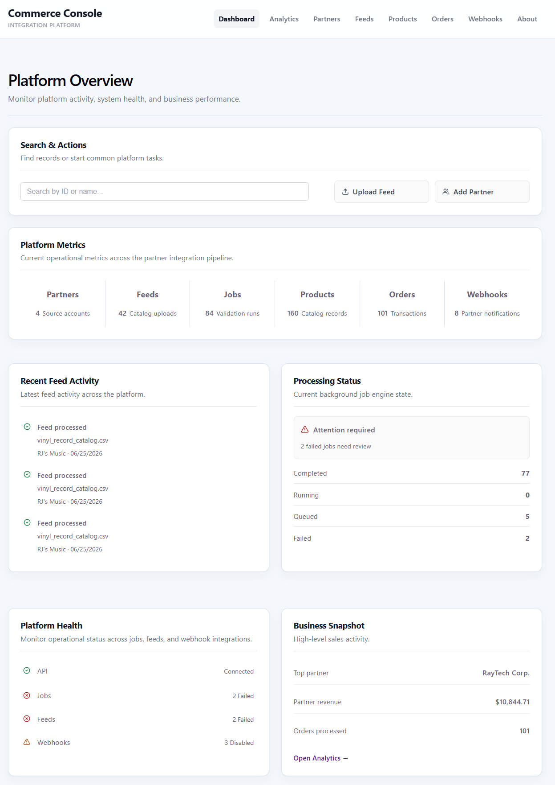{ .console-screenshot }

<strong>Dashboard overview.</strong> The dashboard consolidates platform health, processing activity, commerce metrics, and recent operational events into a single administrative view.

## Dashboard components

The dashboard is organized into several panels, each providing visibility into a different aspect of platform operations.

### Platform health

Displays the operational status of core platform services including feed processing, background jobs, webhook activity, and API availability.

### Platform operations summary

Provides an end-to-end operational snapshot across major business workflows including partners, uploads, processing, products, orders, and webhook subscriptions.

### Commerce overview

Highlights key business metrics including processed orders, leading partners, and platform revenue.

### Recent activity

Displays recently processed catalog feeds with processing status and timestamps.

### Job status

Summarizes background processing jobs by execution state, allowing operators to quickly identify failures or long-running operations.

## Partners

Partner organizations represent the entry point into the platform. The Partners section provides administrators with visibility into external integrations, associated product feeds, and ongoing operational activity for each connected organization.

Key capabilities include:

- View partner information
- Register new partners
- Review associated feeds
- Monitor integration activity

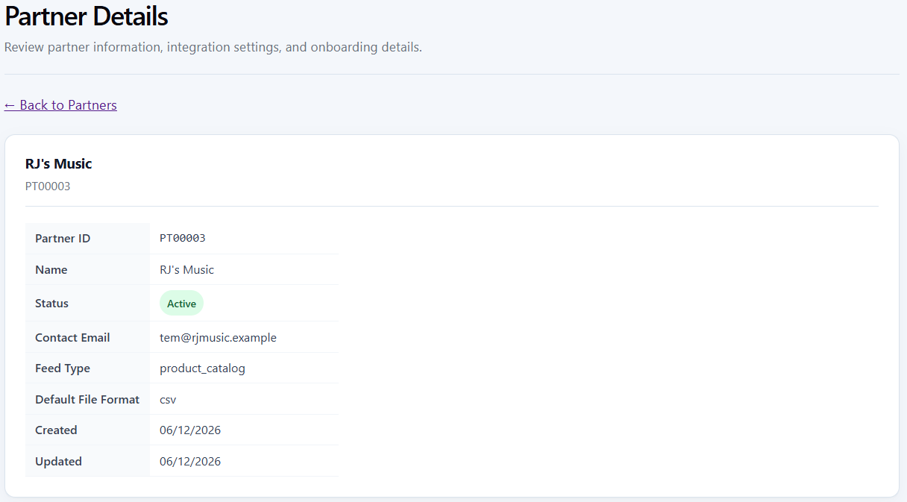{ .console-screenshot }

<strong>Partner details.</strong> Partner profiles provide access to integration settings, associated product feeds, and operational activity, enabling administrators to monitor the status of external commerce integrations.

## Feed management

Product catalog ingestion begins in the Feeds section, where administrators upload partner catalogs and monitor each stage of the ingestion pipeline. From initial submission through validation and background processing, the console provides operational visibility into every uploaded feed.

Key capabilities include:

- Upload CSV product feeds
- Review validation results
- Monitor processing status
- View processing statistics
- Navigate to processing job details

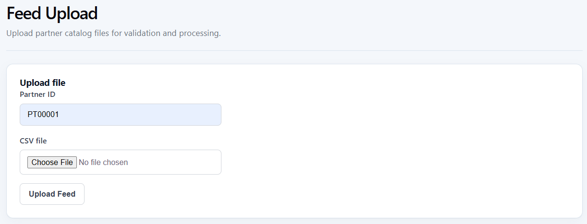{ .console-screenshot }

<strong>Feed upload.</strong> Product catalog feeds are uploaded for a selected partner, initiating the validation and ingestion workflow.

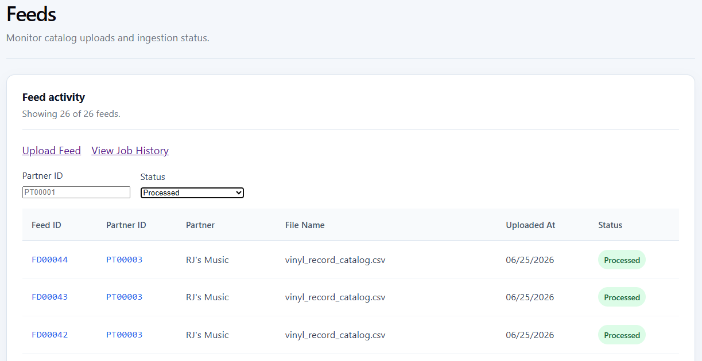{ .console-screenshot }

<strong>Feed activity.</strong> The feed history provides operational visibility into uploaded catalogs, processing status, timestamps, and associated partners.

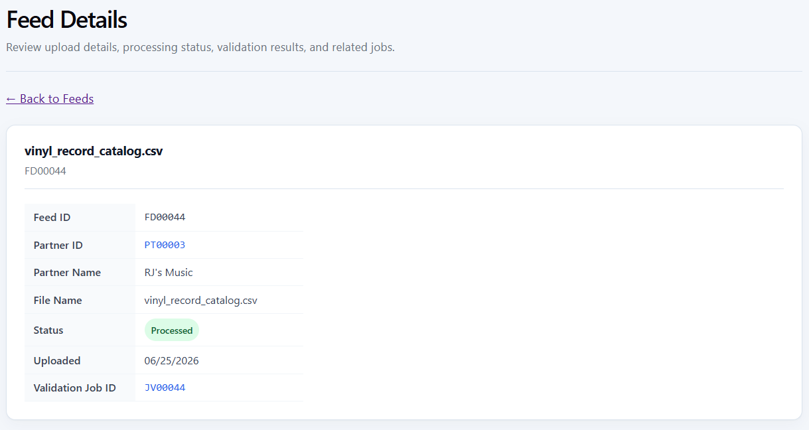{ .console-screenshot }

<strong>Feed details.</strong> Individual feed records summarize validation results, processing statistics, and links to the associated background job for operational troubleshooting.

## Product catalog

Successfully validated products become immediately available through the Product Catalog, where administrators can verify imported data, review catalog attributes, and confirm that partner feeds have been processed correctly.

Key capabilities include:

- Browse products
- Search product records
- Review imported attributes
- Navigate through paginated results
- Inspect individual product details

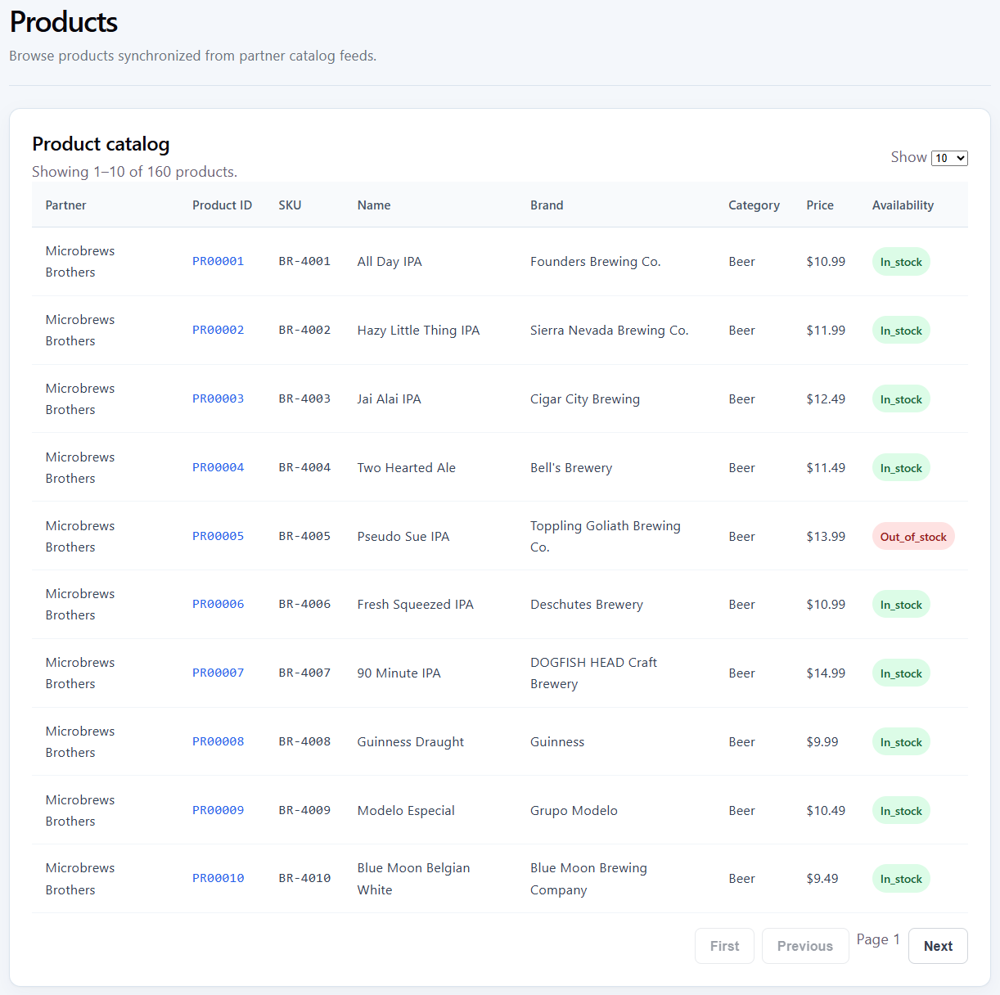{ .console-screenshot }

<strong>Product catalog.</strong> Imported catalog data can be searched, browsed, and reviewed through a paginated interface, providing operational visibility into products available for downstream order processing.

## Orders

The Orders section provides visibility into customer transactions generated from the product catalog. Administrators can review complete order lifecycles, including customer information, purchased items, shipment details, and fulfillment status.

Key capabilities include:

- Browse customer orders
- Review order contents
- View shipment information
- Navigate customer relationships
- Inspect individual transactions

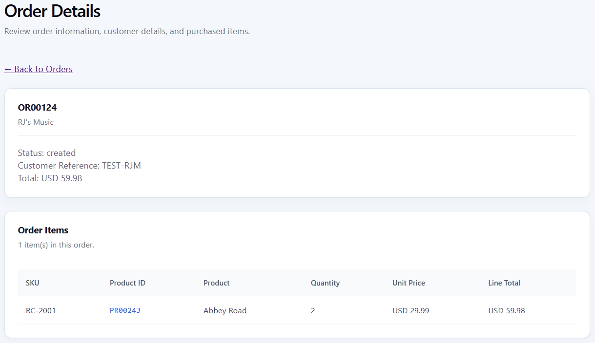{ .console-screenshot }

<strong>Order details.</strong> Individual orders include customer information, line items, shipment details, and order status, providing complete visibility into transactional workflows from creation through fulfillment.

## Webhooks

The Webhooks section provides operational visibility into outbound event notifications delivered to partner systems. Administrators can monitor subscriptions, review delivery history, inspect response codes, and verify successful communication with downstream integrations.

Key capabilities include:

- Manage webhook subscriptions
- Review delivery history
- View delivery responses
- Monitor notification status

These capabilities support validation, troubleshooting, and ongoing monitoring of partner integrations.

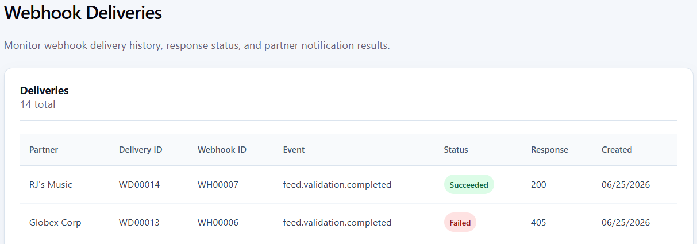{ .console-screenshot }

<strong>Webhook deliveries.</strong> Webhook subscriptions and delivery history provide visibility into outbound event notifications, response codes, and delivery status, supporting validation and troubleshooting of downstream integrations.

## Analytics

The Analytics section transforms operational data into actionable business insights. Interactive dashboards summarize partner performance, revenue trends, order activity, and platform utilization, helping administrators understand both system operations and business outcomes.

Available reporting includes:

- Revenue by partner
- Order volume
- Platform activity
- Operational metrics

These reports complement day-to-day operational monitoring by providing a broader view of platform performance and partner activity.

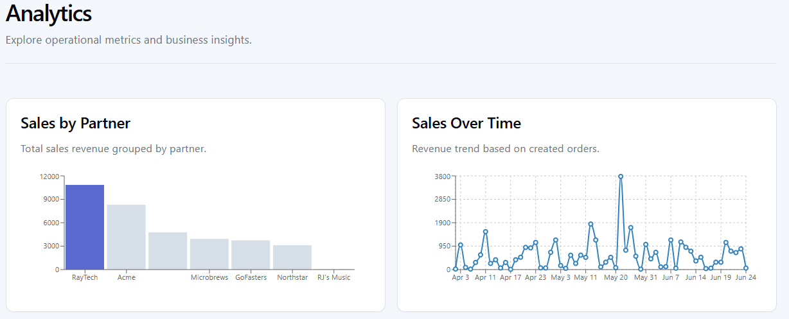{ .console-screenshot }

<strong>Analytics.</strong> Interactive dashboards summarize partner performance, revenue trends, and operational metrics, providing business insights alongside day-to-day platform monitoring.

## Global search

Global Search provides a single entry point for locating operational resources across the platform. Rather than navigating between administrative pages, users can quickly search for partners, products, orders, feeds, processing jobs, and webhooks from anywhere in the application.

Supported resources include:

- Partners
- Products
- Orders
- Feeds
- Processing jobs
- Webhooks

Global Search improves operational efficiency by reducing navigation time and providing direct access to related platform resources.

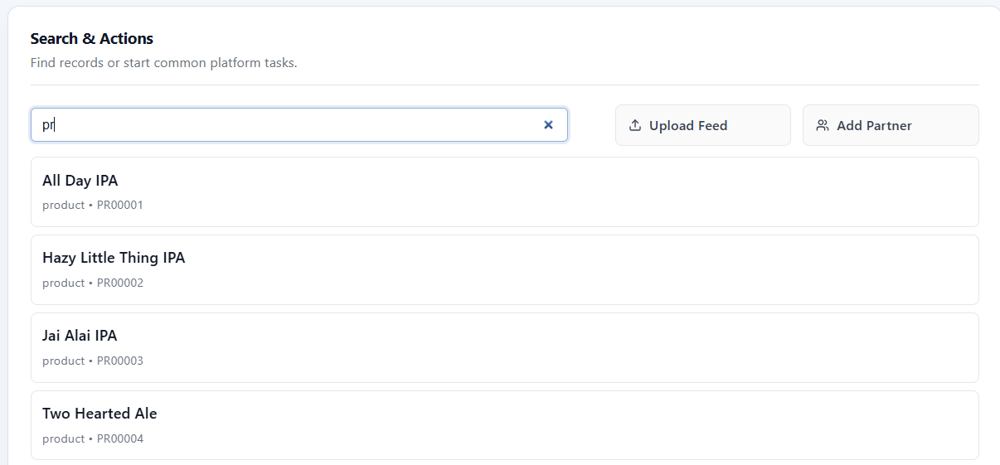{ .console-screenshot }

<strong>Global search.</strong> A unified search interface provides rapid navigation across partners, products, orders, feeds, processing jobs, and webhooks, helping administrators quickly locate operational resources from anywhere in the application.

## Navigation

The console uses a consistent interface across all administrative pages.

Common capabilities include:

- Client-side navigation
- Responsive layouts
- Pagination
- Detail pages
- Status indicators
- Contextual links
- Search and filtering

These patterns provide a consistent operational experience regardless of resource type.

## Operational workflow

The Operations Console presents the platform lifecycle as a connected operational workflow. The primary stages mirror the Platform Operations Summary displayed on the dashboard.


The primary workflow tracks partner activity from onboarding through catalog ingestion, processing, commerce transactions, and outbound webhook subscriptions. Supporting dashboard views provide additional context:

- **Recent activity** shows the latest feed-processing events.
- **Processing status** summarizes completed, running, queued, and failed jobs.
- **Platform health** reports API, feed, job, and webhook status.
- **Commerce overview** summarizes orders, revenue, and partner performance.

Together, these capabilities provide administrators with complete operational visibility across the partner integration lifecycle, from initial catalog ingestion through transaction processing, webhook delivery, and business reporting.